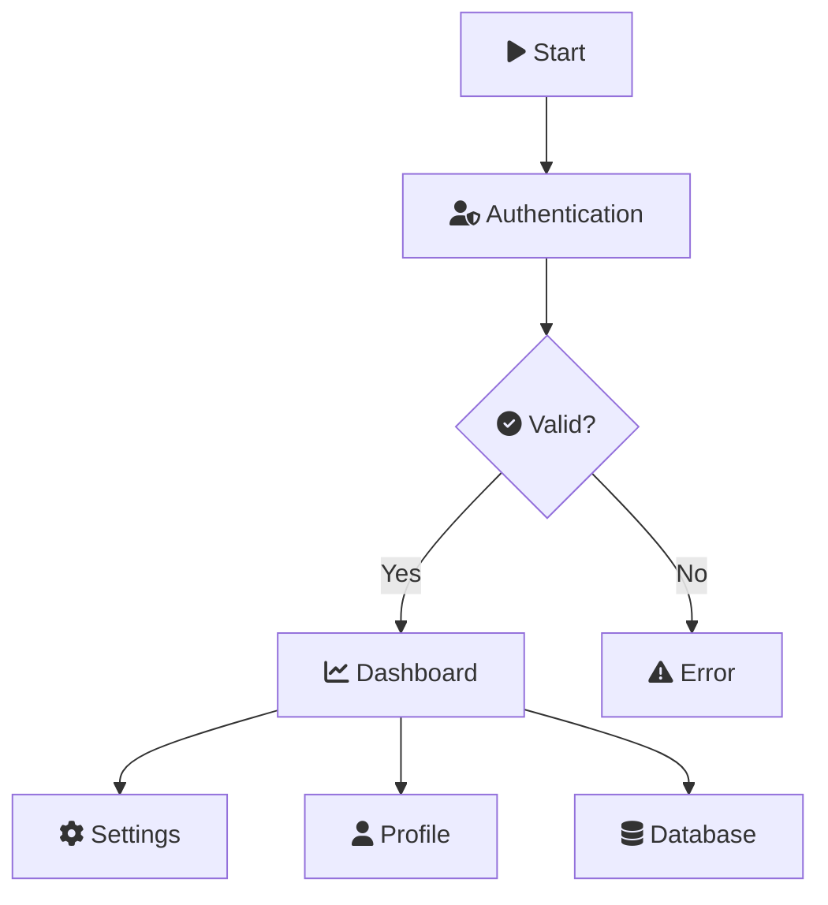

# Font Awesome Icon Support - Implemented ✅

## Summary
Font Awesome 6.2.0 icon support has been **fully implemented** and is available in **v1.0.11**.

## Implementation Details

### ✨ New Settings

#### `fontAwesomeEnabled` (boolean, default: `true`)
Enables automatic Font Awesome 6.2.0 CDN loading for all exports.

```json
{
  "mermaidExportPro.fontAwesomeEnabled": true
}
```

#### `customCss` (array of URLs)
Supports additional custom CSS stylesheets (http/https/file:// URLs).

```json
{
  "mermaidExportPro.customCss": [
    "https://example.com/custom-icons.css",
    "file:///C:/Users/me/custom-styles.css"
  ]
}
```

### 🎨 Usage Example



### 🔧 How It Works

**Web Export Strategy (Webview)**
- Injects `<link rel="stylesheet" href="https://cdnjs.cloudflare.com/ajax/libs/font-awesome/6.2.0/css/all.min.css" />` into webview HTML
- Updated Content Security Policy to allow `cdnjs.cloudflare.com`

**CLI Export Strategy (mmdc command)**
- Generates temporary CSS file with `@import url("https://cdnjs.cloudflare.com/ajax/libs/font-awesome/6.2.0/css/all.min.css");`
- Passes CSS file to mmdc via `--cssFile` flag
- Handles custom CSS URLs (downloads http/https, inlines file://)

### 📁 Demo & Testing

Created comprehensive test file: **[demo/06-font-awesome-icons.md](https://github.com/GSejas/mermaid-export-pro/blob/master/demo/06-font-awesome-icons.md)**

Includes examples with:
- Flowcharts with Font Awesome icons
- Sequence diagrams with icons
- Class diagrams with icons
- State diagrams with icons
- Entity relationship diagrams with icons
- Git graphs with icons

All **371 unit tests passing** ✅

### 🔗 Supported Icon Syntax

Use standard Mermaid Font Awesome syntax:
- `fa:fa-user` - User icon
- `fa:fa-database` - Database icon
- `fa:fa-cog` - Settings icon
- `fa:fa-check-circle` - Check icon

See [Font Awesome 6.2.0 icons](https://fontawesome.com/v6/search?o=r&m=free) for full library.

### 🎯 Implementation Status

Both **Option 1** (Font Awesome by default) and **Option 2** (custom CSS setting) have been implemented:

- ✅ **Option 1**: Font Awesome 6.2.0 enabled by default (`fontAwesomeEnabled: true`)
- ✅ **Option 2**: Custom CSS array setting for additional stylesheets
- ✅ Works with both CLI and Web export strategies
- ✅ Respects Content Security Policy
- ✅ Handles file:// and http/https URLs for custom CSS
- ✅ Comprehensive demo and documentation

### 📦 Availability

Feature is available in:
- **Version**: v1.0.11
- **Branch**: master
- **Commit**: [27ba687](https://github.com/GSejas/mermaid-export-pro/commit/27ba687)

### 📖 Documentation

- **CHANGELOG.md**: Added Font Awesome feature section
- **README.md**: Updated with new settings
- **Demo**: [06-font-awesome-icons.md](https://github.com/GSejas/mermaid-export-pro/blob/master/demo/06-font-awesome-icons.md)

---

**Closing this issue as resolved.** 🎉

If you encounter any issues with Font Awesome support, please open a new issue with details.
