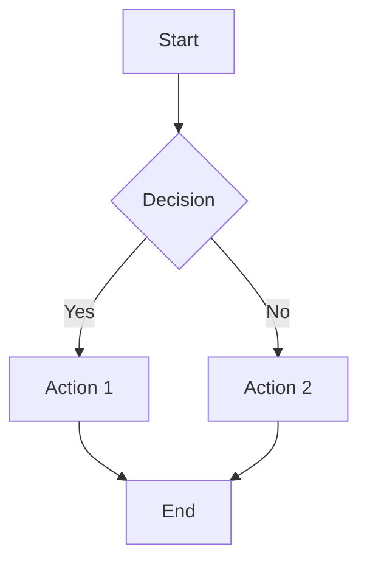

# Mermaid Export Pro - Debug Report

**Timestamp**: 2025-08-24T23:21:04.883Z
**Test Diagram**:


**Export Options**:
- Format: svg
- Theme: default
- Dimensions: 800x600
- Background: white

## Results

### CLI Strategy

- **Status**: ✅ SUCCESS
- **Duration**: 10972ms
- **Version**: 11.9.0
- **Output Files**:
  - diagram.svg (11810 bytes)

### Web Strategy

- **Status**: ✅ SUCCESS
- **Duration**: 1181ms
- **Version**: N/A
- **Output Files**:
  - diagram.svg (12530 bytes)

## File Verification

- **diagram.svg**: ✅ exists, ✅ contains SVG, ✅ contains graph data
- **diagram.svg**: ✅ exists, ✅ contains SVG, ✅ contains graph data

## Quick Commands

To inspect files manually:
```bash
# Windows PowerShell
Get-Content "c:/Users/delir/Documents/repos/content-creator-app/debug-exports/2025-08-24_23-20-52-724ZZ/*/diagram.*" | Select-String "<svg"

# Mac/Linux  
ls -la c:\Users\delir\Documents\repos\content-creator-app\debug-exports\2025-08-24_23-20-52-724ZZ/*/
grep -l "svg" c:\Users\delir\Documents\repos\content-creator-app\debug-exports\2025-08-24_23-20-52-724ZZ/*/diagram.*
```

## Next Steps

1. **If CLI failed**: Install @mermaid-js/mermaid-cli globally or locally
2. **If Web failed**: Check VS Code webview support and browser security
3. **If both succeeded**: Compare output quality and file sizes
4. **Performance**: CLI took 10972ms, Web took 1181ms
