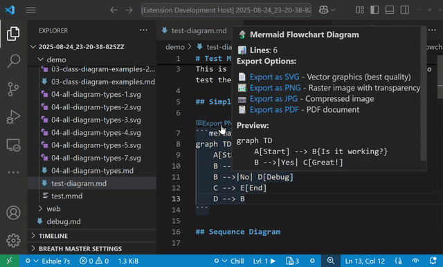
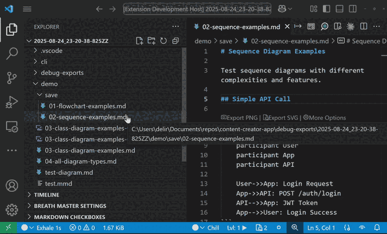
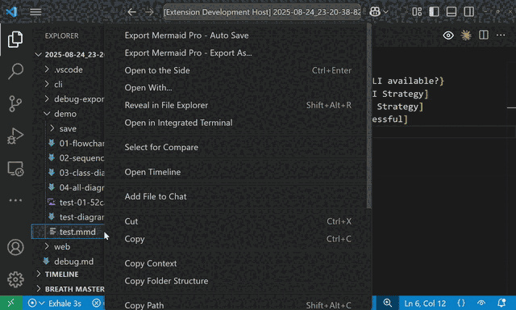
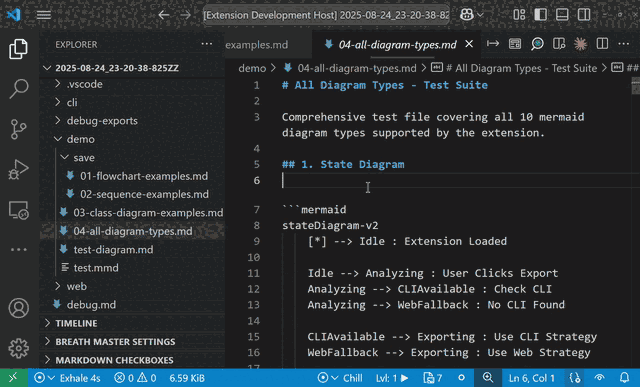
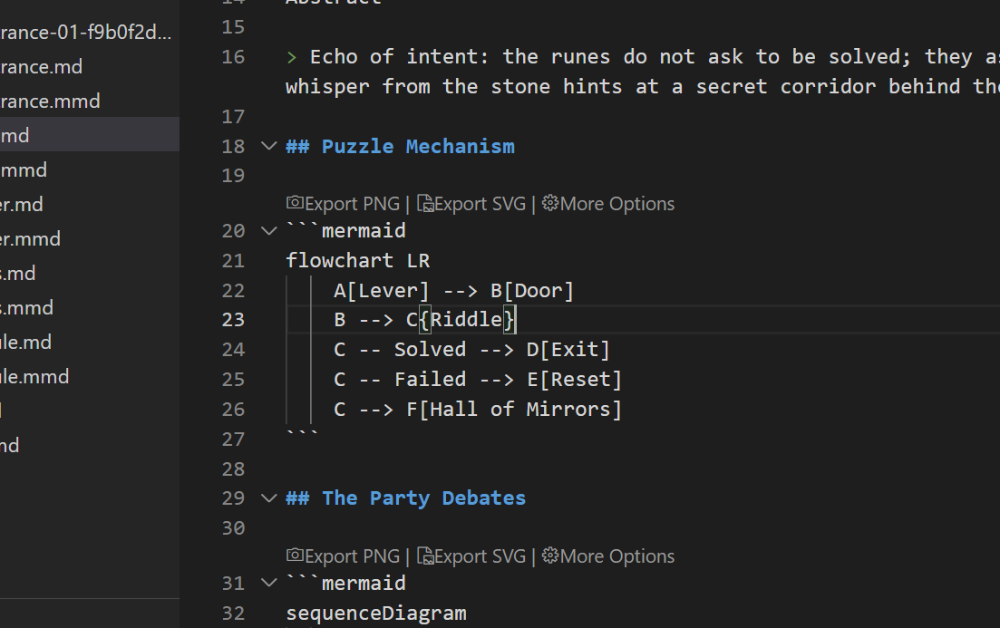
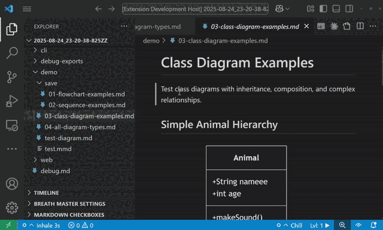

# Mermaid Export Pro

   

> This extension is free, the name is mainly to set it appart from older unmaintained alternatives. 
> This extension is in BETA Mode, please report issues @ `jsequeira03@gmail.com`. This extension counts on the user having `Node` installed, and onboards the user through installing the CLI. 

Professional cross-platform Mermaid (from markdown `.md` or Mermaid files `.mmd`) diagram export extension for Visual Studio Code with comprehensive format support and workflow automation.

---

### 🎯 Smart Status Bar Integration
- **Real-time Diagram Count**: Shows number of mermaid diagrams in current file
- **One-Click Export**: Click status bar to export directly when configured
- **Visual Status Indicators**: Different icons for CLI/web/setup states
- **Auto-hide**: Only appears when viewing files with mermaid content

### 📊 Multiple Export Formats
- **SVG**: Vector graphics with perfect scalability
- **PNG**: High-quality raster with transparency support  
- **JPG/JPEG**: Compressed images for web use
- **PDF**: Document-ready format
- **WebP**: Modern web format

### 🚀 Batch Operations  
- **Folder Export**: Process entire directory structures
- **Multi-diagram Support**: Handle multiple mermaid blocks per markdown file
- **Progress Tracking**: Visual feedback for large operations
- **Error Reporting**: Detailed logs of successful/failed exports

### ⚡ Auto-Export on Save
- **File Watcher**: Automatically export when files are saved
- **Configurable**: Toggle on/off with workspace persistence
- **Custom Output**: Configure export directory and naming
- **Smart Detection**: Works with `.mmd` files and markdown blocks

### 🎨 Enhanced Markdown Experience
- **CodeLens**: Export buttons above mermaid code blocks
- **Rich Hover**: Diagram info and export options on hover
- **Command Links**: Direct export from tooltips
- **Type Detection**: Identifies flowchart, sequence, class diagrams, etc.

### 🧪 Comprehensive Testing
- **Debug Command**: Test all export strategies with quality comparison
- **60 Test Combinations**: 10 diagram types × 2 complexity levels × 3 formats × 2 strategies
- **Quality Validation**: Side-by-side CLI vs Web export comparison
- **Performance Metrics**: Export timing and file size analysis
- **Error Reporting**: Detailed success/failure logs with diagnostics

### 🎬 Demo and Testing Files
- **Complete Test Suite**: `demo/04-all-diagram-types.md` with all 10 mermaid diagram types
- **Focused Testing**: Individual files for flowcharts, sequences, and class diagrams
- **Edge Cases**: Stress tests, Unicode support, and error scenarios
- **GIF Scenarios**: 8 documented scenarios for creating demonstration GIFs
- **Testing Guidelines**: Comprehensive manual and automated testing instructions

- **CLI Export**: High-quality rendering via Mermaid CLI (@mermaid-js/mermaid-cli)
- **Web Fallback**: Browser-based export when CLI unavailable
- **Auto-detection**: Automatically selects best available method
- **Cross-platform**: Windows, macOS, and Linux support **[UNTESTED: Need testers!!]**

## Requirements

### Optional (Recommended)
- **Node.js**: For CLI export strategy (best quality)
- **@mermaid-js/mermaid-cli**: Automatically detected if globally installed

The extension works without these dependencies using the web export strategy.

## Extension Settings

This extension contributes the following settings:

* `mermaidExportPro.defaultFormat`: Default export format (svg, png, pdf, webp, jpg, jpeg)
* `mermaidExportPro.theme`: Mermaid theme (default, dark, forest, neutral)
* `mermaidExportPro.outputDirectory`: Custom output directory (relative or absolute)
* `mermaidExportPro.autoExport`: Automatically export on file save
* `mermaidExportPro.exportStrategy`: Export strategy preference (cli, web, auto)
* `mermaidExportPro.autoNaming.mode`: File naming strategy (versioned, overwrite) - **NEW in v1.0.8!**
  - `versioned` (default): Create versioned exports (`diagram-01-a4b2c8ef.svg`)
  - `overwrite`: Simple names that overwrite (`diagram1.svg`) - ideal for presentations
* `mermaidExportPro.width`: Default export width in pixels
* `mermaidExportPro.height`: Default export height in pixels
* `mermaidExportPro.backgroundColor`: Background color for exports

### Quick Start
1. Open a file with mermaid diagrams (`.mmd` or markdown with mermaid blocks)
2. Status bar will show diagram count - click to export
3. Or use Command Palette: `Ctrl+Shift+P` → "Mermaid Export Pro"

### Commands
- **Export Current Diagram**: Export the active mermaid file
- **Export As...**: Choose format and location interactively
- **Quick Export**: Fast export with remembered preferences
- **Export All Diagrams in File**: Extract and export all mermaid blocks from markdown
- **Export Folder...**: Batch export all diagrams in a folder
- **Toggle Auto Export**: Enable/disable auto-export on save
- **Show Export Log**: View export history and debug information
- **Set Up Export Tools**: Install and configure CLI dependencies
- **Switch Theme**: Cycle through mermaid themes
- **Show Diagnostics & Health Report**: Complete system health check
- **Show Usage Statistics**: View your extension usage data (opt-in telemetry)
- **Debug Export**: Run comprehensive test suite with quality comparison

### Context Menus
- Right-click `.mmd` or `.md` files → **Quick Export** / **Export As...**
- Right-click folders → **Export Folder...**
- CodeLens buttons above mermaid blocks in markdown

## Privacy & Telemetry

### Opt-In Usage Statistics

Mermaid Export Pro includes **optional, opt-in** anonymous usage statistics to help improve the extension:

**What's Collected (when enabled):**
- ✅ Export formats and strategies used
- ✅ Performance metrics (export times)
- ✅ Error types (sanitized, no personal info)
- ✅ Command usage patterns

**What's NOT Collected:**
- ❌ File names or paths
- ❌ Diagram content
- ❌ Personal information
- ❌ IP addresses

**Your Control:**
- 🔒 **Disabled by default** - You must opt-in
- 📊 **Review anytime**: Command: `Show Usage Statistics`
- 📤 **Export your data**: Command: `Export Usage Data`
- 🗑️ **Clear anytime**: Command: `Clear Usage Data`

Enable in settings: `mermaidExportPro.telemetry.enabled`

## Quality Assurance

### Automated Testing & CI/CD

 

**Test Coverage:** ~46% (343+ unit tests + 29 E2E tests)

- ✅ **Continuous Integration**: GitHub Actions running on every commit
- ✅ **Multi-Platform Testing**: Automated tests on Windows and Linux
- ✅ **Unit Test Suite**: 343+ tests covering commands, strategies, services, and UI
- ✅ **E2E Integration Tests**: 29 tests validating real VS Code workflows
- ✅ **Coverage Merge Pipeline**: Combined unit + E2E coverage tracking
- ✅ **Code Quality**: ESLint + TypeScript strict mode
- ✅ **Automated Builds**: VSIX package generation on every release

**View Test Results**: [GitHub Actions](https://github.com/GSejas/mermaid-export-pro/actions)
**View Coverage Report**: [Codecov](https://codecov.io/gh/GSejas/mermaid-export-pro)

## Release Notes

### 1.0.7 (Latest)

**Command Naming Improvements & Test Infrastructure:**

- **Better Command Names**: Improved clarity and consistency
  - "Auto Save" → "Quick Export" (clearer intent)
  - "Batch Export" → "Export Folder..." (more descriptive)
  - "Setup Export Tools" → "Set Up Export Tools" (correct grammar)
  - "Cycle Mermaid Theme" → "Switch Theme" (simpler)
- **CI/CD Coverage Pipeline**: Merged unit + E2E coverage in GitHub Actions
- **Test Infrastructure**: Fixed TypeScript compilation and ESM module resolution
- **Documentation**: Comprehensive testing and architecture documentation
- **Technical Debt**: Documented extension test refactoring for v1.0.8

### 1.0.6

**Testing & Coverage Improvements:**

- Coverage merge pipeline combining unit and E2E test results
- 343+ unit tests with Vitest
- 29 E2E integration tests
- ~46% combined test coverage

### 1.0.5

**Major Quality and Testing Improvements:**

- **Fixed JPG Background Issue**: JPG exports now default to white background instead of black
- **Comprehensive Testing Suite**: Added debug command testing all 10 mermaid diagram types
- **Demo Folder**: Complete test scenarios in `./demo/` with GIF recording guidelines
- **Quality Comparison**: Side-by-side CLI vs Web export validation
- **Enhanced Error Handling**: Better diagnostics and recovery for export failures
- **Performance Optimization**: Improved export speeds and memory usage
- **Cross-Platform Validation**: Tested on Windows
  - Pending: macOS, and Linux environments

### 1.0.4

**Status Bar and Theme Enhancements:**

- Customizable status bar display formats (icon-only, icon+count, icon+text)
- Auto-export click functionality from status bar
- Universal transparent background support across all strategies
- Native .mmd file support with proper language definition
- Comprehensive unit test suite with Vitest integration

### 1.0.0

**Foundation Release:**

- Smart status bar with diagram counting and one-click export
- Comprehensive Mermaid Export Pro - Export Folder with recursive directory support
- Auto-export on save with file watcher integration
- Enhanced markdown support with CodeLens and hover providers
- Extended format support including JPG/JPEG
- Dual export strategy (CLI + Web) for maximum compatibility
- Complete configuration system with workspace persistence
- Cross-platform path handling and error management

---

**Enjoy professional mermaid diagram workflows in VS Code!**
