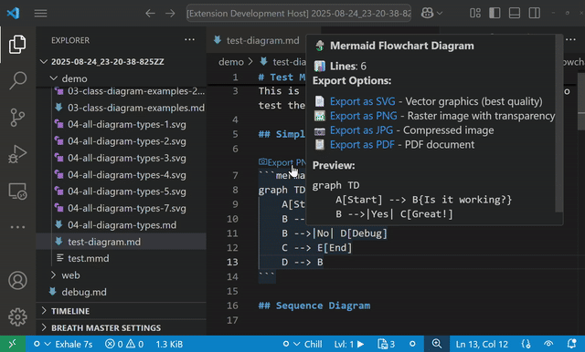
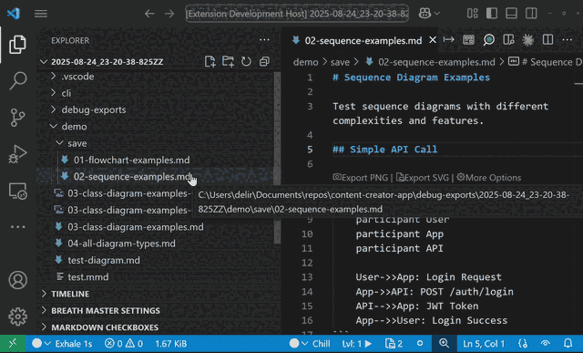
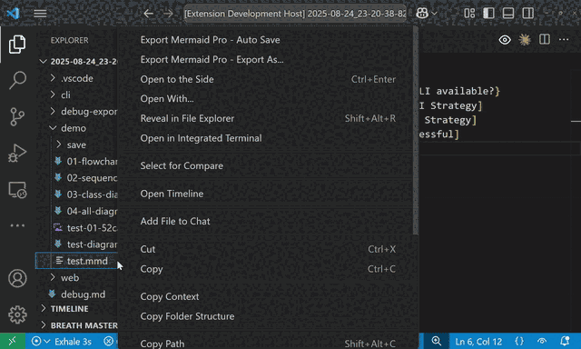
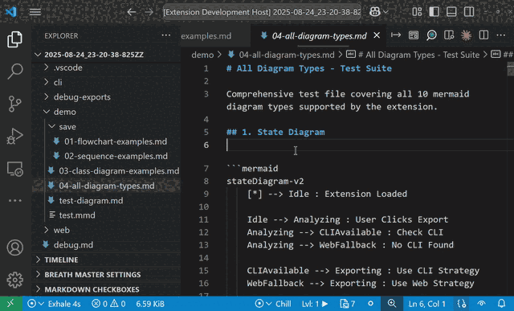
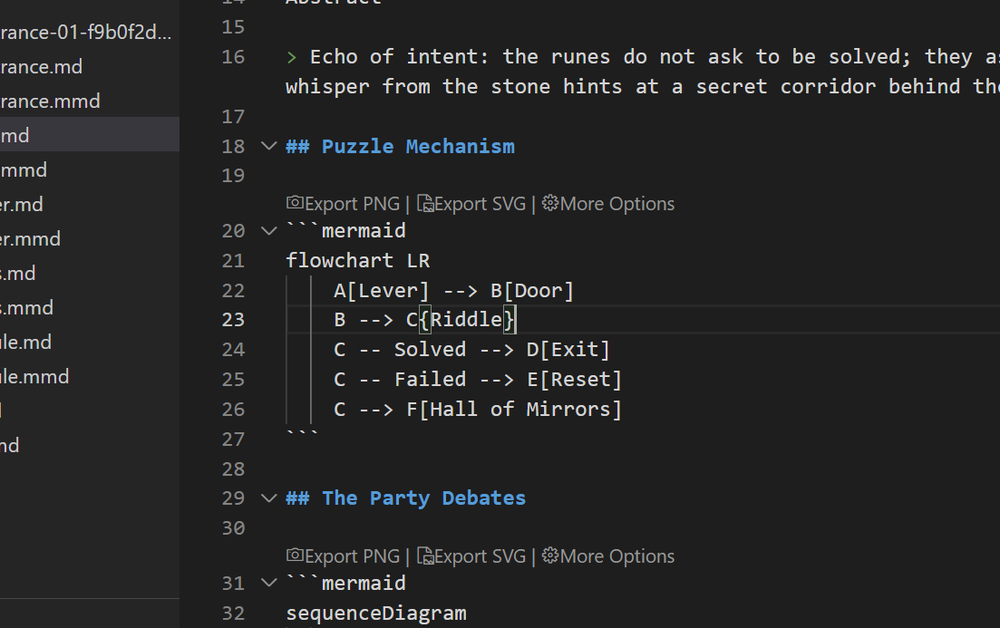
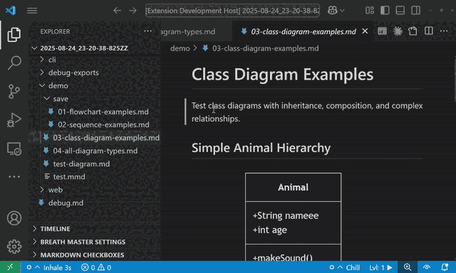

# Mermaid Export Pro

[](https://github.com/GSejas/mermaid-export-pro/actions/workflows/test.yml) [](https://codecov.io/gh/GSejas/mermaid-export-pro) [](https://github.com/GSejas/mermaid-export-pro/releases/tag/v1.1.0) [](LICENSE)



> **Free & Open Source** - The "Pro" name distinguishes this from older, unmaintained alternatives.  
> **Beta Status** - Please report issues to `jsequeira03@gmail.com` or [GitHub Issues](https://github.com/GSejas/mermaid-export-pro/issues).  
> **Node.js Recommended** - While optional, Node.js enables high-quality CLI exports. The extension includes a guided setup wizard.


Export Mermaid diagrams from `.md` (markdown) and `.mmd` files to professional-quality images across Windows, macOS, and Linux with comprehensive format support and workflow automation.


---


### 🎯 Smart Status Bar Integration
- **Real-time Diagram Count**: Shows number of mermaid diagrams in current file
- **One-Click Export**: Click status bar to export directly when configured
- **Visual Status Indicators**: Different icons for CLI/web/setup states
- **Auto-hide**: Only appears when viewing files with mermaid content




### 📊 Multiple Export Formats
- **SVG**: Vector graphics with perfect scalability
- **PNG**: High-quality raster with transparency support  
- **JPG/JPEG**: Compressed images for web use
- **PDF**: Document-ready format
- **WebP**: Modern web format


### 🚀 Batch Operations  
- **Folder Export**: Process entire directory structures
- **Multi-diagram Support**: Handle multiple mermaid blocks per markdown file
- **Progress Tracking**: Visual feedback for large operations
- **Error Reporting**: Detailed logs of successful/failed exports



### ⚡ Auto-Export on Save
- **File Watcher**: Automatically export when files are saved
- **Configurable**: Toggle on/off with workspace persistence
- **Custom Output**: Configure export directory and naming
- **Smart Detection**: Works with `.mmd` files and markdown blocks



### 🎨 Enhanced Markdown Experience
- **CodeLens**: Export buttons above mermaid code blocks
- **Rich Hover**: Diagram info and export options on hover
- **Command Links**: Direct export from tooltips
- **Type Detection**: Identifies flowchart, sequence, class diagrams, etc.

### 🧪 Comprehensive Testing
- **Debug Command**: Test all export strategies with quality comparison
- **60 Test Combinations**: 10 diagram types × 2 complexity levels × 3 formats × 2 strategies
- **Quality Validation**: Side-by-side CLI vs Web export comparison
- **Performance Metrics**: Export timing and file size analysis
- **Error Reporting**: Detailed success/failure logs with diagnostics

### 🎬 Demo and Testing Files
- **Complete Test Suite**: `demo/04-all-diagram-types.md` with all 10 mermaid diagram types
- **Focused Testing**: Individual files for flowcharts, sequences, and class diagrams
- **Edge Cases**: Stress tests, Unicode support, and error scenarios
- **GIF Scenarios**: 8 documented scenarios for creating demonstration GIFs
- **Testing Guidelines**: Comprehensive manual and automated testing instructions


**Dual Export Strategies for Maximum Flexibility:**

- **CLI Export**: Premium quality rendering via `@mermaid-js/mermaid-cli` (requires Node.js)
- **Web Fallback**: Browser-based export when CLI is unavailable - works anywhere
- **Auto-Detection**: Intelligently selects the best available method
- **Cross-Platform**: Tested on Windows | macOS & Linux support (seeking testers!)

## Requirements

### Recommended (For Best Quality)

- **Node.js**: Required for CLI export strategy (highest quality output)
- **@mermaid-js/mermaid-cli**: Auto-detected if globally installed, or installed via setup wizard

### Fallback Option

The extension works without these dependencies using the built-in web export strategy (good quality, zero setup).

## 🔒 Security & Vulnerability Management

### Automated Dependency Scanning

Mermaid Export Pro maintains a commitment to security through:

- **Regular Security Audits**: Weekly automated scanning via `npm audit` for known vulnerabilities
- **Dependency Updates**: Rapid patching of direct dependencies (latest patches applied)
- **Transparency**: Public [release notes](https://github.com/GSejas/mermaid-export-pro/releases) document security updates
- **Responsible Disclosure**: Report security issues to `jsequeira03@gmail.com`

### Current Security Status (v1.1.0)

**Last Audit**: Automated security scan completed during release
**Direct Dependencies**: All current versions patched
**Transitive Dependencies**: Known vulnerabilities tracked and monitored

**Remaining Notes**: Some transitive dependencies (in Puppeteer, Mocha test framework) have known vulnerabilities in deeply nested dependencies. These are:
- **Development-Only Risk**: Testing frameworks (not included in production extension)
- **No User Impact**: Extension execution doesn't trigger vulnerable code paths
- **Upgrade Path Blocked**: Upstream maintainers need to publish patches
- **Monitoring**: Tracked via GitHub Dependabot alerts

### Best Practices for Users

1. **Keep VS Code Updated**: Latest extensions framework = better security
2. **Update Node.js** (if using CLI export): Keep Node.js current for Puppeteer compatibility
3. **Report Issues**: Found a security issue? Email `jsequeira03@gmail.com` with details
4. **Review Settings**: Use workspace-specific export directories for sensitive projects

### Dependencies Overview

**Production Dependencies** (included in extension):
- `@vscode/vsce`: VS Code package management (actively maintained)
- `chalk`: Terminal colors for CLI output (stable, no vulnerabilities)

**Development Dependencies** (for build/testing, not distributed):
- `@types/vscode`: VS Code API types (maintained by Microsoft)
- `typescript`: Language compiler (actively maintained by Microsoft)
- `vitest`: Test framework (actively maintained, security patches applied v3.2.4)
- `sinon`: Test mocking library (security patches applied v21.1.2)

**Runtime Dependencies** (installed separately):
- `@mermaid-js/mermaid-cli`: Mermaid diagram rendering (v11.9.0)
- `mermaid.js`: Web fallback rendering (bundled, v10.9.2)

## Extension Settings



This extension contributes the following settings:

* `mermaidExportPro.defaultFormat`: Default export format (svg, png, pdf, webp, jpg, jpeg)
* `mermaidExportPro.theme`: Mermaid theme (default, dark, forest, neutral)
* `mermaidExportPro.backgroundColor`: Background color for exports (transparent, white, black, custom hex)
* `mermaidExportPro.fontAwesomeEnabled`: Enable Font Awesome icons in exports (default: true) - **NEW in v1.0.11!**
* `mermaidExportPro.customCss`: Custom CSS URLs for exports (e.g., additional icon libraries) - **NEW in v1.0.11!**
* `mermaidExportPro.outputDirectory`: Custom output directory (relative or absolute)
* `mermaidExportPro.batchExportMode`: Folder export behavior - **NEW in v1.0.11!**
  - `interactive` (default): Guided wizard with dialogs
  - `automatic`: Zero-dialog export using your JSON settings (like Quick Export)
* `mermaidExportPro.autoExport`: Automatically export on file save
* `mermaidExportPro.exportStrategy`: Export strategy preference (cli, web, auto)
* `mermaidExportPro.autoNaming.mode`: File naming strategy (versioned, overwrite) - **NEW in v1.0.8!**
  - `versioned` (default): Create versioned exports (`diagram-01-a4b2c8ef.svg`)
- 
  - `overwrite`: Simple names that overwrite (`diagram1.svg`) - ideal for presentations
* `mermaidExportPro.organizeByFormat`: Organize exports into format subfolders (e.g., `png/`, `svg/`)
* `mermaidExportPro.width`: Default export width in pixels
* `mermaidExportPro.height`: Default export height in pixels

### ⚙️ Configuration Example

For zero-dialog folder exports (respects your settings):

```json
{
  "mermaidExportPro.batchExportMode": "automatic",
  "mermaidExportPro.defaultFormat": "svg",
  "mermaidExportPro.theme": "dark",
  "mermaidExportPro.backgroundColor": "transparent",
  "mermaidExportPro.outputDirectory": "exported-diagrams",
  "mermaidExportPro.organizeByFormat": true
}
```

**Result**: Right-click folder → Export Folder → Done! No dialogs, uses your configured settings.


### Quick Start

1. **Open** a file containing mermaid diagrams (`.mmd` file or markdown with mermaid code blocks)
2. **Status Bar** shows diagram count - click to export instantly
3. **Or use Command Palette**: `Ctrl+Shift+P` → "Mermaid Export Pro"

### Available Commands

**Export Commands:**
- **Export Current Diagram** - Export the active mermaid file
- **Export As...** - Choose format and location interactively  
- **Quick Export** - Fast export with remembered preferences
- **Export All Diagrams in File** - Extract and export all mermaid blocks from markdown
- **Export Folder...** - Batch export all diagrams in a directory

**Workflow Commands:**
- **Toggle Auto Export** - Enable/disable auto-export on file save
- **Show Export Log** - View export history and debug information
- **Set Up Export Tools** - Guided installation of CLI dependencies
- **Switch Theme** - Cycle through mermaid themes (default, dark, forest, neutral)

**Diagnostics:**
- **Show Diagnostics & Health Report** - Complete system health check
- **Show Usage Statistics** - View your extension usage data (opt-in telemetry)
- **Debug Export** - Run comprehensive test suite with quality comparison

### Context Menu Options

- **Right-click `.mmd` or `.md` files** → Quick Export / Export As...
- **Right-click folders** → Export Folder...
- **CodeLens buttons** above mermaid blocks in markdown for instant export

## Privacy & Telemetry

### Opt-In Anonymous Usage Statistics

Mermaid Export Pro includes **completely optional** anonymous telemetry to help improve the extension based on real-world usage patterns.

**What's Tracked (Only When Enabled):**

- ✅ Export formats used (SVG, PNG, PDF, etc.)
- ✅ Export strategies selected (CLI vs Web)
- ✅ Performance metrics (export duration, file sizes)
- ✅ Error types encountered (sanitized, no personal details)
- ✅ Command usage frequency

**What's NEVER Collected:**

- ❌ File names or file paths
- ❌ Diagram content or code
- ❌ Personal information or workspace details
- ❌ IP addresses or identifying data

**You Have Full Control:**

- 🔒 **Disabled by default** - Telemetry is opt-in only
- 📊 **Review anytime** - Command: `Show Usage Statistics`
- 📤 **Export your data** - Command: `Export Usage Data` (JSON format)
- 🗑️ **Delete anytime** - Command: `Clear Usage Data`
- ⚙️ **Enable/disable** - Setting: `mermaidExportPro.telemetry.enabled`

All telemetry data stays on your machine unless you choose to export and share it.

## Quality Assurance

### Automated Testing & Continuous Integration

[](https://github.com/GSejas/mermaid-export-pro/actions/workflows/test.yml) [](https://codecov.io/gh/GSejas/mermaid-export-pro)

**Test Coverage:** ~46% combined (371 unit tests + 29 E2E integration tests)

**Continuous Quality Checks:**

- ✅ **GitHub Actions CI/CD** - Automated testing on every commit
- ✅ **Multi-Platform Testing** - Windows and Linux validation
- ✅ **371 Unit Tests** - Commands, strategies, services, and UI components
- ✅ **29 E2E Tests** - Real VS Code workflows and user scenarios
- ✅ **Merged Coverage** - Combined unit + integration coverage tracking
- ✅ **Code Quality** - ESLint strict mode + TypeScript type checking
- ✅ **Automated Releases** - VSIX package generation on version tags

**Review Quality Metrics:**

- [View Test Results](https://github.com/GSejas/mermaid-export-pro/actions) - GitHub Actions workflow runs
- [View Coverage Report](https://codecov.io/gh/GSejas/mermaid-export-pro) - Detailed coverage analysis

## Release Notes

### 1.0.10 (Current)

**Telemetry Integration & Code Quality:**

- **Fixed Telemetry Tracking** - Telemetry service now properly wired to export commands
  - Previously: Service existed but never connected to export operations
  - Now: Tracks export counts, formats, strategies, duration, and file sizes
- **Post-Mortem Documentation** - Comprehensive analysis of why bug wasn't caught initially
- **Release Checklist** - 85-item verification checklist for future releases
- **Code Quality** - Resolved 122 ESLint warnings for cleaner codebase
- **371 Tests Passing** - Full unit test suite validation

### 1.0.9

**Progress Notification & Auto-Naming Improvements:**

- **Fixed Progress Flash** - No more progress notifications when exports are skipped
- **Versioned Mode Enhancement** - Skip unchanged diagrams in versioned mode
- **21 Integration Tests** - Comprehensive auto-naming test coverage
- **Early Return Pattern** - Check skip conditions before showing UI

### 1.0.8

**Auto-Naming & File Management:**

- **Smart File Naming** - Versioned exports with content hashing (`diagram-01-a4b2c8ef.svg`)
- **Overwrite Mode** - Simple naming for presentations (`diagram1.svg`)
- **Skip Logic** - Avoid re-exporting unchanged diagrams

### 1.0.7

**Command Naming & Test Infrastructure:**

- **Clearer Command Names** - Improved discoverability and consistency
  - "Auto Save" → "Quick Export"
  - "Batch Export" → "Export Folder..."
- **CI/CD Coverage** - Merged unit + E2E coverage pipeline
- **Enhanced Documentation** - Testing and architecture guides

### 1.0.5

**Major Quality and Testing Improvements:**

- **Fixed JPG Background Issue**: JPG exports now default to white background instead of black
- **Comprehensive Testing Suite**: Added debug command testing all 10 mermaid diagram types
- **Demo Folder**: Complete test scenarios in `./demo/` with GIF recording guidelines
- **Quality Comparison**: Side-by-side CLI vs Web export validation
- **Enhanced Error Handling**: Better diagnostics and recovery for export failures
- **Performance Optimization**: Improved export speeds and memory usage
- **Cross-Platform Validation**: Tested on Windows
  - Pending: macOS, and Linux environments

### 1.0.4

**Status Bar and Theme Enhancements:**

- Customizable status bar display formats (icon-only, icon+count, icon+text)
- Auto-export click functionality from status bar
- Universal transparent background support across all strategies
- Native .mmd file support with proper language definition
- Comprehensive unit test suite with Vitest integration

### 1.0.0

**Foundation Release:**

- Smart status bar with diagram counting and one-click export
- Comprehensive Mermaid Export Pro - Export Folder with recursive directory support
- Auto-export on save with file watcher integration
- Enhanced markdown support with CodeLens and hover providers
- Extended format support including JPG/JPEG
- Dual export strategy (CLI + Web) for maximum compatibility
- Complete configuration system with workspace persistence
- Cross-platform path handling and error management

---

**Enjoy professional mermaid diagram workflows in VS Code!**
