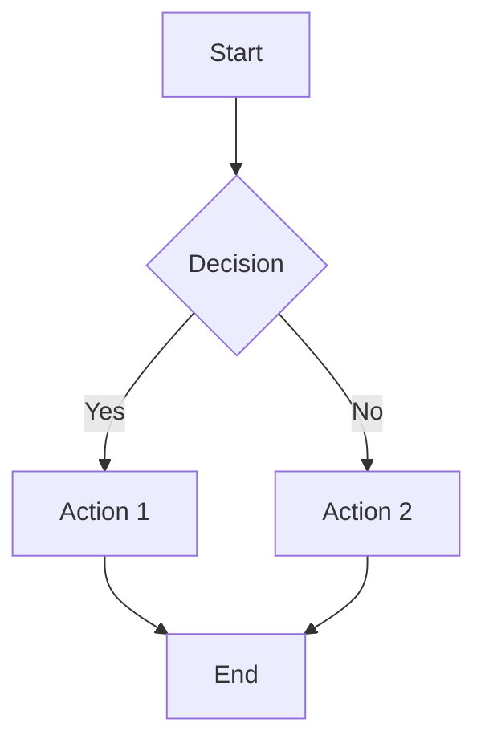
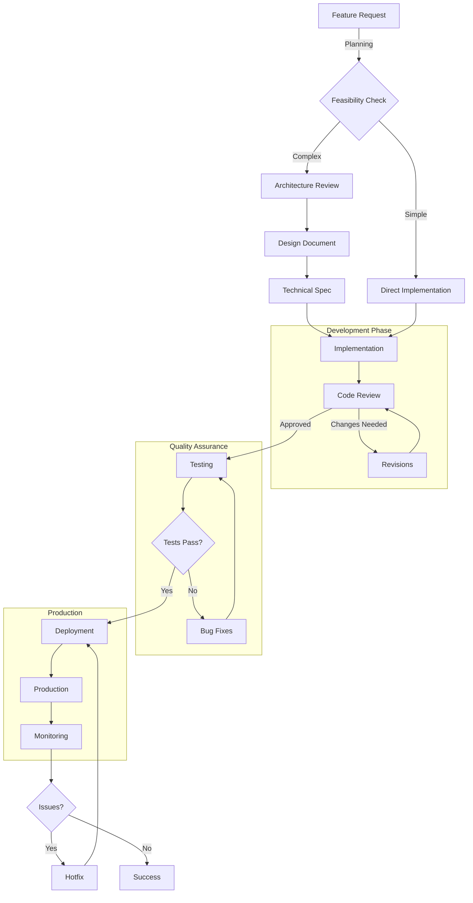

# Flowchart Examples

Test various flowchart scenarios to validate export functionality.

## Simple Decision Flow

## Complex Software Development Flow

## Export Test Instructions

1. Right-click on each diagram
2. Select "Export Mermaid Diagram"
3. Test different formats (SVG, PNG, JPG)
4. Verify output quality and file size