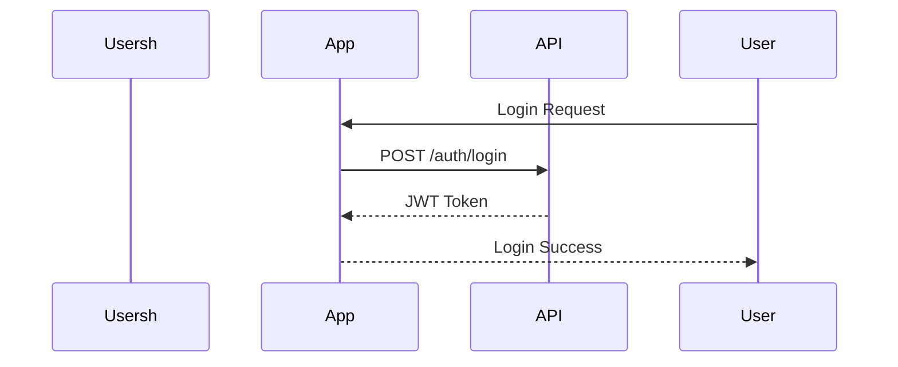
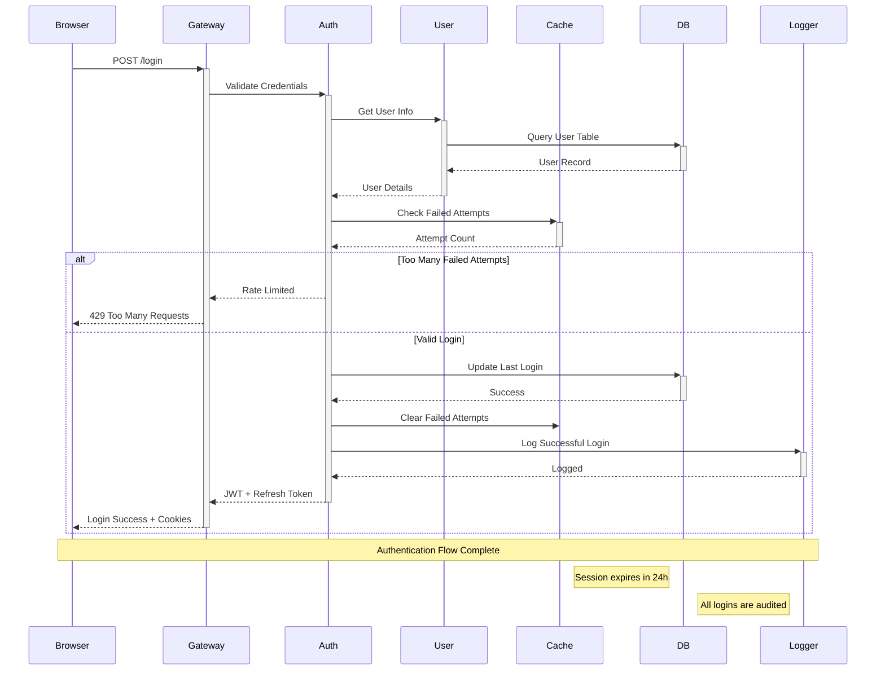

# Sequence Diagram Examples

Test sequence diagrams with different complexities and features.

## Simple API Call

## Complex Microservices Authentication

## Testing Notes

- Test with long participant names
- Verify arrow types render correctly
- Check note positioning and text wrapping
- Validate alt/else block rendering