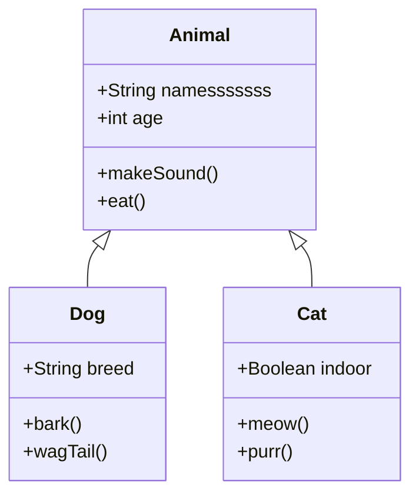
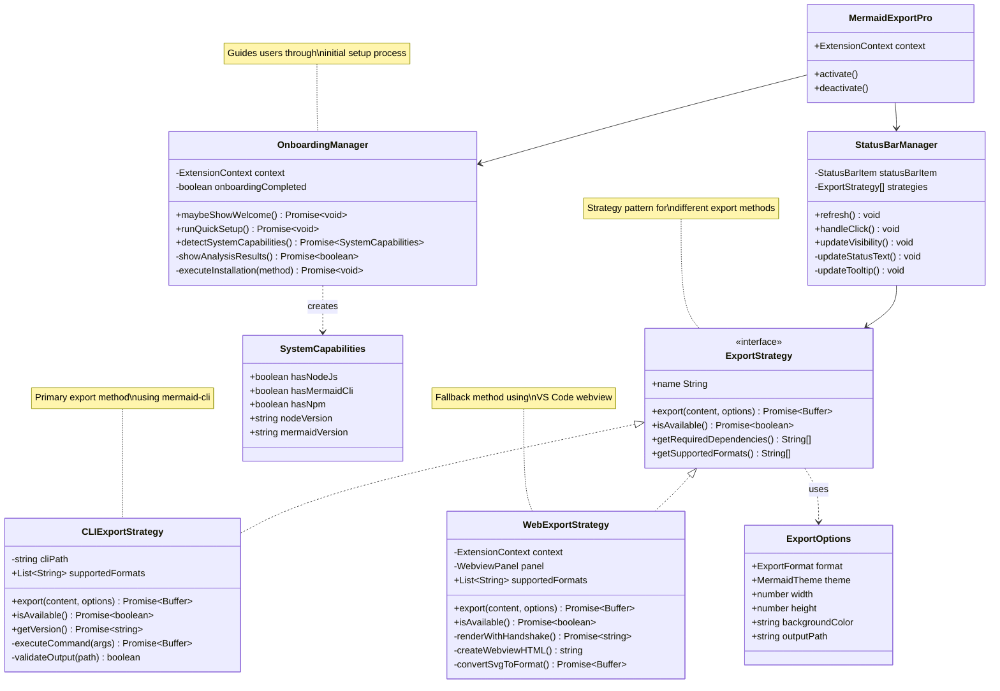

# Class Diagram Examples

Test class diagrams with inheritance, composition, and complex relationships.

## Simple Animal Hierarchy

## Complex Software Architecture

## Testing Checklist

- [ ] Class names render properly
- [ ] Method signatures display correctly  
- [ ] Inheritance arrows point in right direction
- [ ] Composition diamonds appear
- [ ] Interface stereotypes show
- [ ] Notes are positioned well
- [ ] Long method names don't overflow boxes
- [ ] Generic types display properly