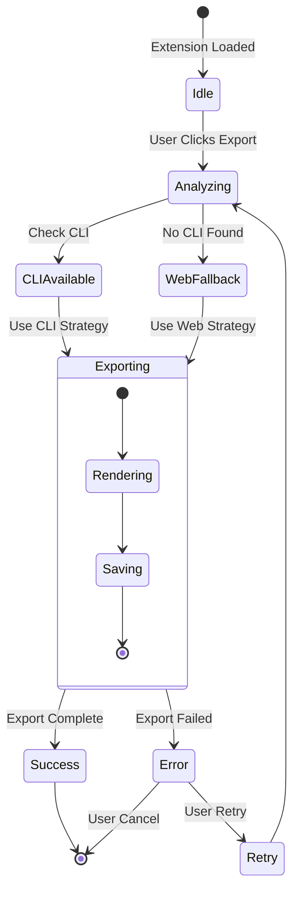
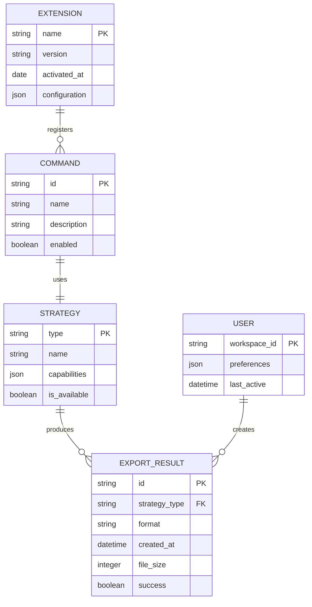
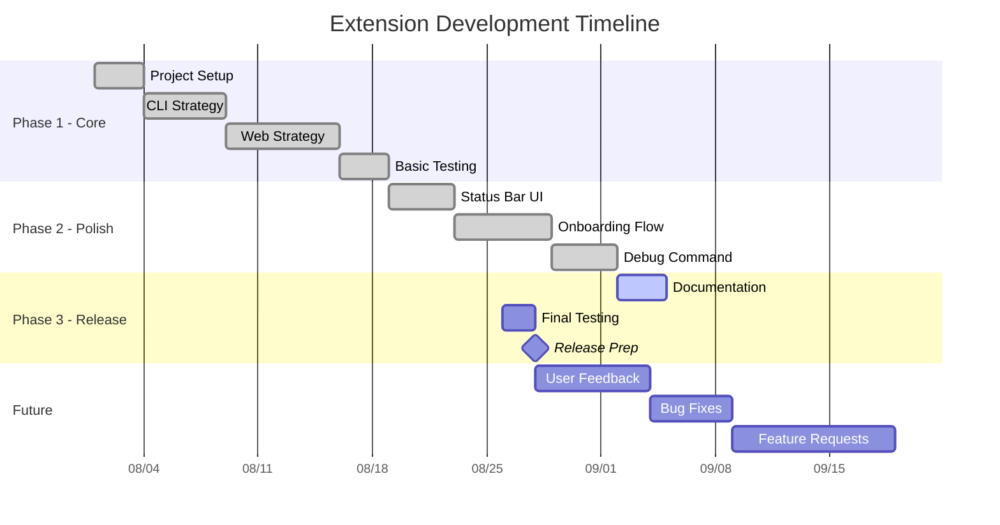
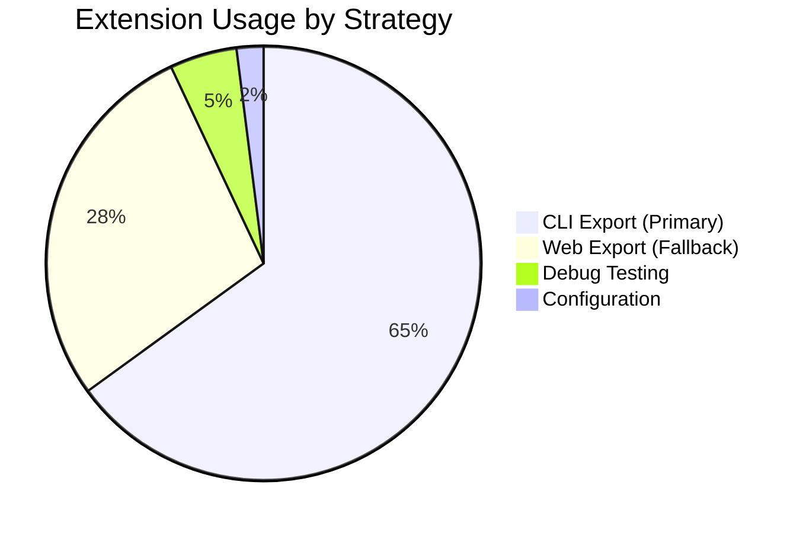
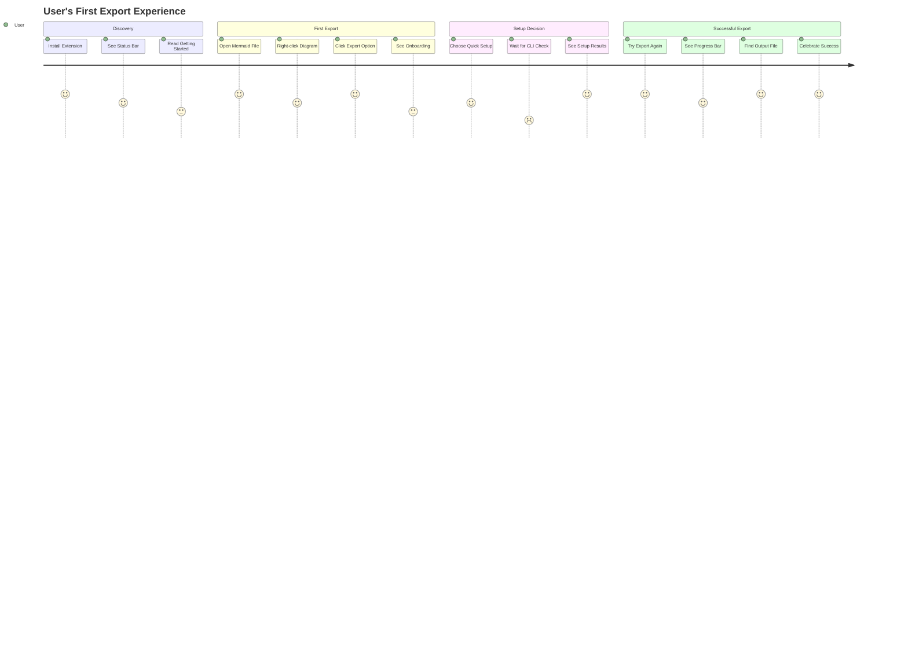
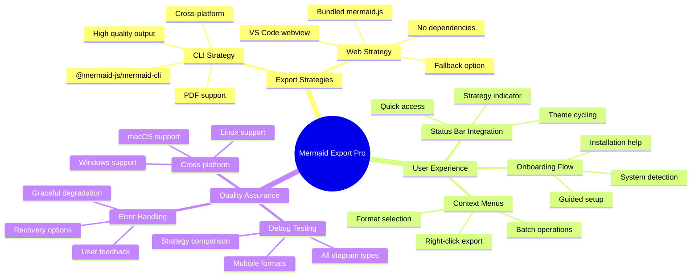

# All Diagram Types - Test Suite

Comprehensive test file covering all 10 mermaid diagram types supported by the extension.

## 1. State Diagram



## 2. Entity Relationship Diagram



## 3. Gantt Chart



## 4. Pie Chart



## 5. Journey Map



## 6. Git Graph

```mermaid
gitgraph
    commit id: "Initial Extension"
    commit id: "Add CLI Strategy"
    
    branch feature/web-export
    checkout feature/web-export
    commit id: "Add Web Strategy"
    commit id: "Fix Webview Issues"
    commit id: "Add Format Support"
    
    checkout main
    commit id: "Add Status Bar"
    
    branch feature/onboarding
    checkout feature/onboarding
    commit id: "Add Onboarding Manager"
    commit id: "System Detection"
    
    checkout main
    merge feature/web-export
    commit id: "Version 1.0.0" tag: "v1.0.0"
    
    checkout feature/onboarding
    commit id: "Polish Onboarding"
    
    checkout main
    merge feature/onboarding
    commit id: "Version 1.0.1" tag: "v1.0.1"
    
    branch feature/debug-testing
    checkout feature/debug-testing
    commit id: "Add Debug Command"
    commit id: "Comprehensive Testing"
    
    checkout main
    merge feature/debug-testing
    commit id: "Version 1.0.4" tag: "v1.0.4"
```

## 7. Mind Map



## Testing Instructions

### Manual Testing Steps:
1. **Open this file in VS Code** with the extension installed
2. **Test each diagram type**:
   - Right-click on each mermaid block
   - Select "Export Mermaid Diagram" 
   - Try different formats (SVG, PNG, JPG)
3. **Verify output quality**:
   - Check text readability
   - Verify shapes render correctly  
   - Ensure proper spacing and alignment
4. **Test both strategies**:
   - With CLI installed (primary)
   - Without CLI (web fallback)
5. **Run debug command**: `Ctrl+Shift+P` → "Mermaid Export Pro: Debug Export"

### Expected Results:
- All diagram types export successfully
- Both CLI and Web strategies work
- Output files are properly formatted
- No visual artifacts or corruption
- Reasonable file sizes for each format

### Known Limitations:
- PDF export requires CLI installation
- Some complex diagrams may render differently between strategies
- Web strategy doesn't support all advanced mermaid features