# Edge Cases and Stress Tests

Test scenarios for edge cases, error conditions, and stress testing.

## Very Large Flowchart (Stress Test)


## Unicode and Special Characters

```mermaid
flowchart LR
    A["🚀 Start Process"] --> B{"✅ Is Valid?"}
    B -->|Yes ✓| C["📊 Process Data"]
    B -->|No ❌| D["⚠️ Show Error"]
    C --> E["💾 Save Results"]
    D --> F["🔄 Retry Process"]
    F --> A
    E --> G["🎉 Success!"]
    
    subgraph "Émojis & Ünıçøðé"
        H["Ñoñ-ÄSCII çharàcters"]
        I["数据处理 (Chinese)"]
        J["Обработка данных (Russian)"]
        K["معالجة البيانات (Arabic)"]
    end
    
    G --> H
    H --> I
    I --> J  
    J --> K
```



## Very Long Text Content


## Nested and Complex Structures


## Empty and Minimal Diagrams


## Error Testing Scenarios

### Invalid Mermaid Syntax (Should be handled gracefully)
```
This is not valid mermaid syntax
graph TD
    A --> 
    --> B
```

### Mixed Content
```mermaid
graph TD
    A[Valid] --> B[Node]
sequenceDiagram
    participant Invalid
```

## Testing Checklist for Edge Cases

- [ ] Very large diagrams export without memory issues
- [ ] Unicode characters display correctly in all formats
- [ ] Long text doesn't cause layout problems
- [ ] Deeply nested subgraphs render properly
- [ ] Minimal diagrams don't cause errors
- [ ] Invalid syntax shows appropriate error messages
- [ ] Export doesn't hang or crash on complex diagrams
- [ ] File sizes are reasonable even for large diagrams
- [ ] Both CLI and Web strategies handle edge cases
- [ ] Error recovery works when exports fail