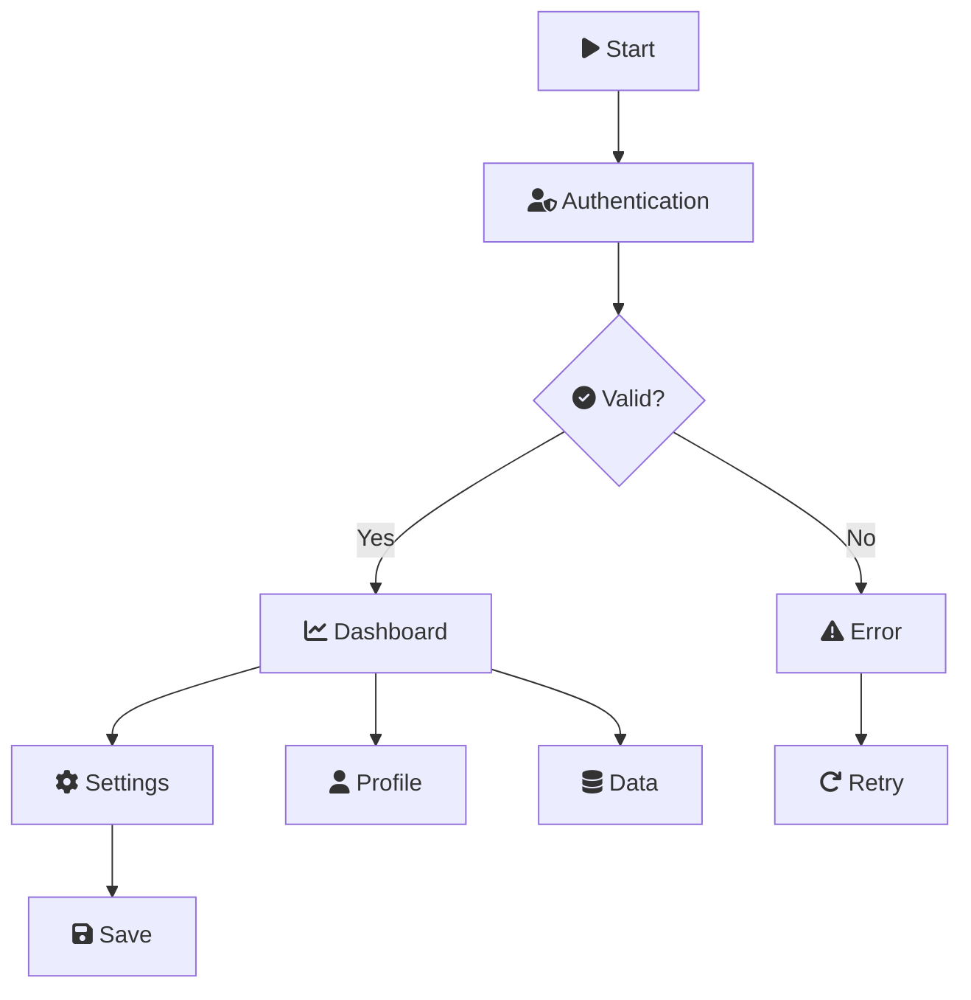
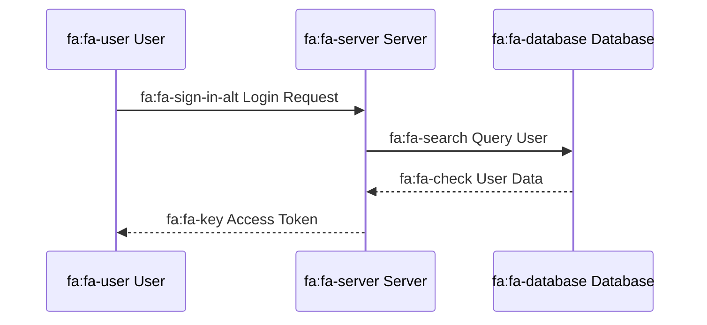
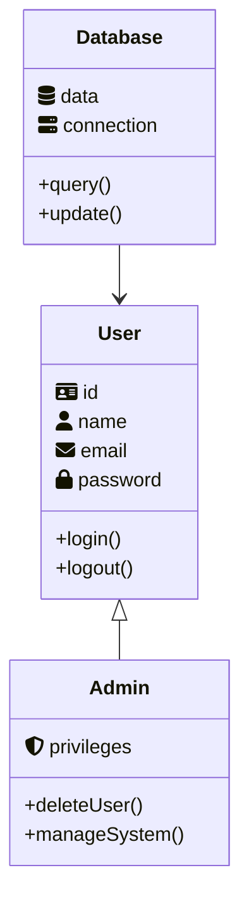
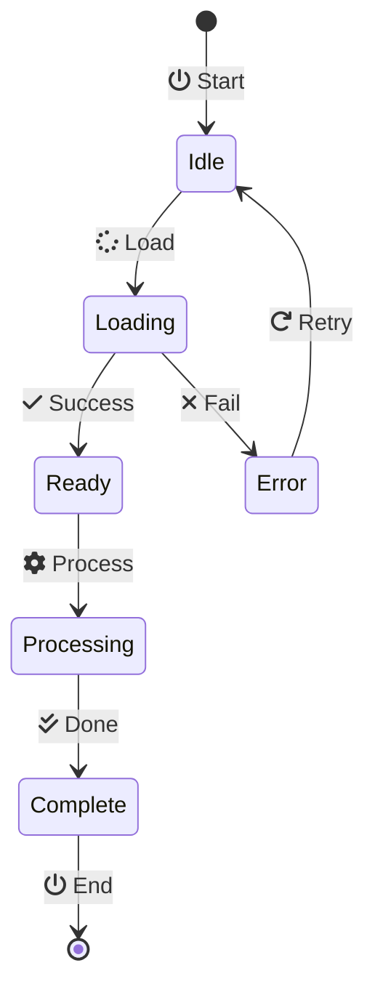
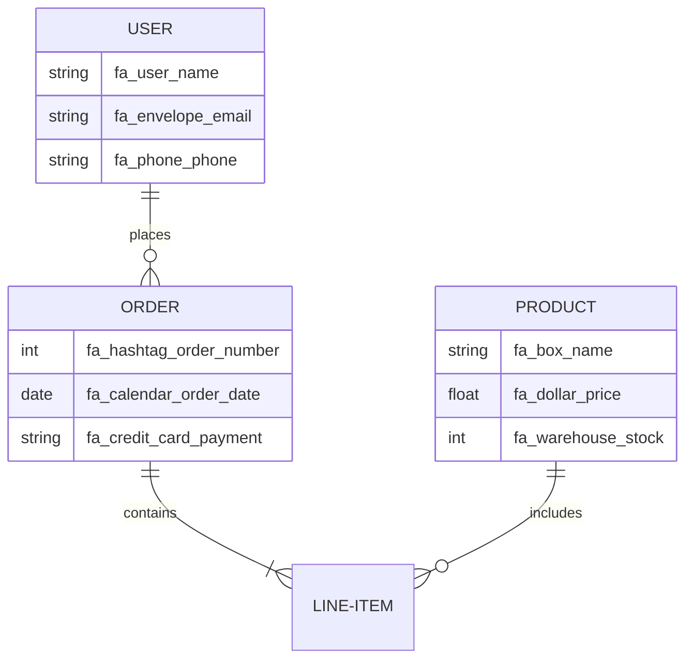
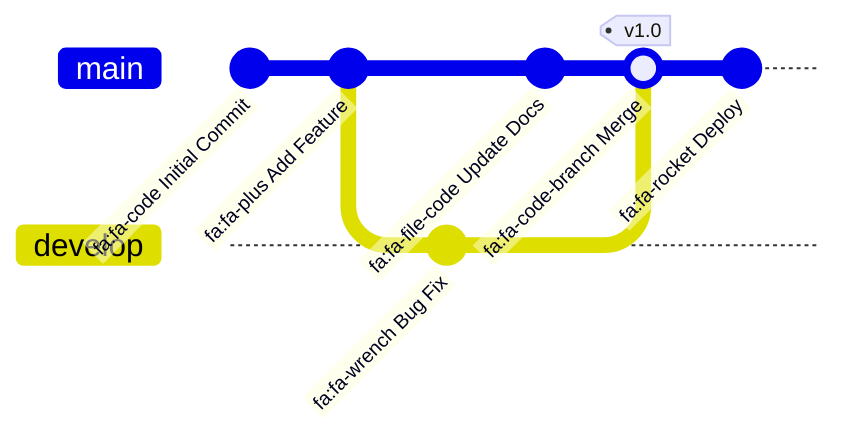

# Font Awesome Icons Test - Mermaid Export Pro

This file tests Font Awesome icon support in Mermaid Export Pro (Issue #3).

## Flowchart with Font Awesome Icons



## Sequence Diagram with Icons



## Class Diagram with Icons



## State Diagram with Icons



## Entity Relationship Diagram with Icons



## Git Graph with Icons



## Testing Instructions

1. **Export this file** using Quick Export or Export As
2. **Verify icons render** in the exported image
3. **Test both strategies**:
   - CLI Export (if @mermaid-js/mermaid-cli installed)
   - Web Export (fallback)
4. **Test custom CSS**:
   ```json
   {
     "mermaidExportPro.customCss": [
       "https://example.com/custom-icons.css"
     ]
   }
   ```
5. **Test disable Font Awesome**:
   ```json
   {
     "mermaidExportPro.fontAwesomeEnabled": false
   }
   ```

## Expected Results

✅ **With fontAwesomeEnabled = true (default)**:
- All fa:fa-* icons render as Font Awesome icons
- Icons appear in all diagram types
- Works with both export strategies

❌ **With fontAwesomeEnabled = false**:
- Icons show as text (e.g., "fa:fa-user")
- Fallback to standard mermaid rendering

## Common Font Awesome Icons for Diagrams

- **Users**: fa:fa-user, fa:fa-users, fa:fa-user-shield
- **Actions**: fa:fa-play, fa:fa-stop, fa:fa-pause, fa:fa-redo
- **Status**: fa:fa-check, fa:fa-times, fa:fa-exclamation, fa:fa-info
- **Data**: fa:fa-database, fa:fa-server, fa:fa-cloud, fa:fa-hdd
- **Navigation**: fa:fa-home, fa:fa-arrow-right, fa:fa-arrow-left
- **Settings**: fa:fa-cog, fa:fa-wrench, fa:fa-sliders, fa:fa-tools
- **Files**: fa:fa-file, fa:fa-folder, fa:fa-file-code, fa:fa-file-pdf
- **Communication**: fa:fa-envelope, fa:fa-phone, fa:fa-comment
- **Security**: fa:fa-lock, fa:fa-unlock, fa:fa-key, fa:fa-shield-alt

## Reference

- Font Awesome 6.2.0: https://fontawesome.com/icons
- Mermaid Icon Support: https://mermaid.js.org/config/icons.html
- GitHub Issue #3: https://github.com/GSejas/mermaid-export-pro/issues/3
