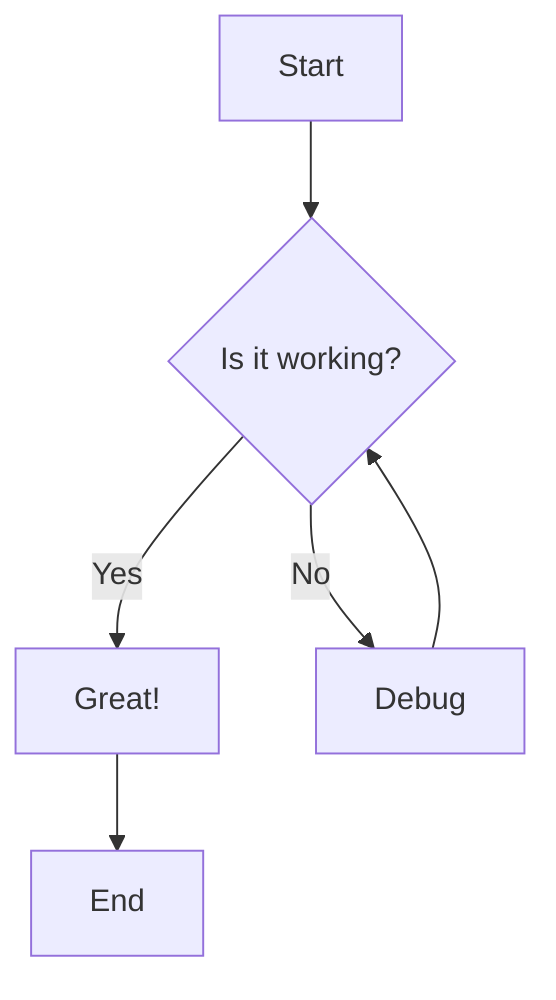
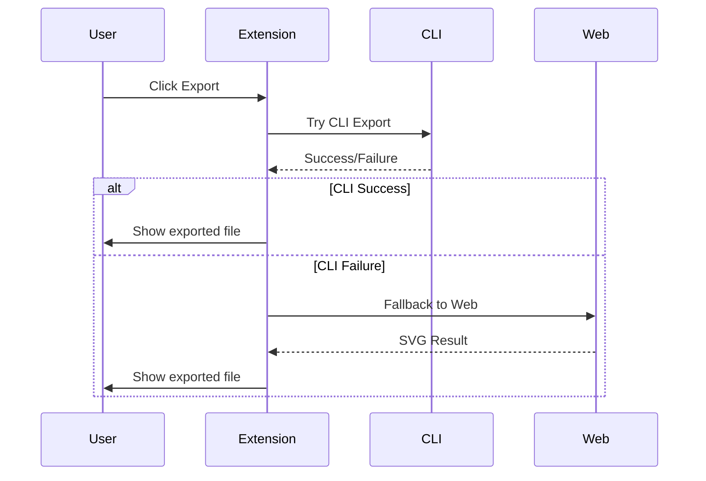
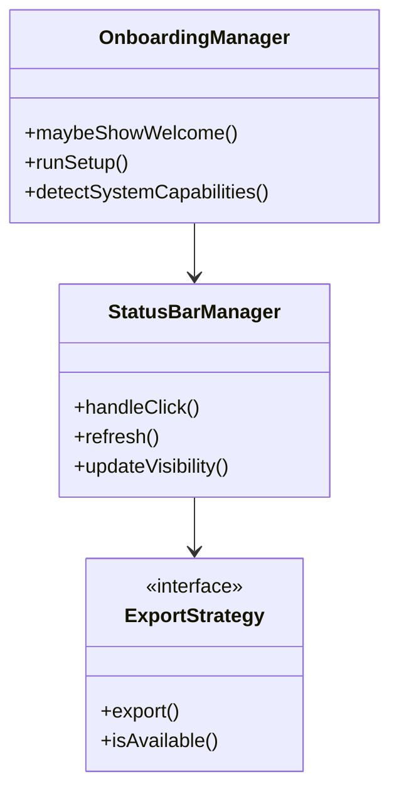

# Test Mermaid Diagram

This is a test markdown file with mermaid diagrams to test the extension functionality.

## Simple Flowchart

## Sequence Diagram

## Class Diagram

Open this file in VS Code and test the extension features!