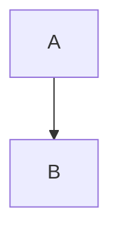
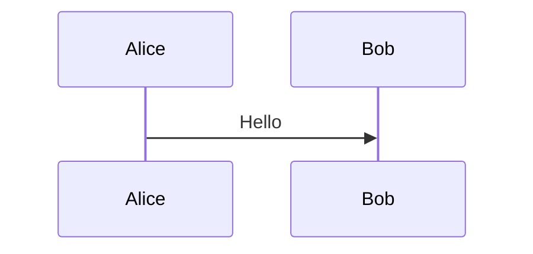

# Mermaid Export Pro - Commands Reference

**Last Updated:** 2025-10-10
**Version:** 1.0.6

Complete technical reference for all VS Code commands in Mermaid Export Pro, including implementation details, usage patterns, and code locations.

---

## 📋 Table of Contents

- [Command Overview](#command-overview)
- [Core Export Commands](#core-export-commands)
- [Batch Operations](#batch-operations)
- [Utility Commands](#utility-commands)
- [Debug & Diagnostics](#debug--diagnostics)
- [Command Registration](#command-registration)
- [Context Menus](#context-menus)
- [Implementation Architecture](#implementation-architecture)

---

## Command Overview

### Quick Reference Table

| Command ID | Title | File | Coverage | Priority |
|------------|-------|------|----------|----------|
| `exportCurrent` | Export Current Diagram | [exportCommand.ts:27](../../src/commands/exportCommand.ts#L27) | 81.63% | High |
| `exportAs` | Export As... | [exportCommand.ts:82](../../src/commands/exportCommand.ts#L82) | 81.63% | High |
| `exportFile` | Quick Export | [exportCommand.ts:154](../../src/commands/exportCommand.ts#L154) | 81.63% | High |
| `exportAll` | Export All Diagrams in File | [exportAllCommand.ts:42](../../src/commands/exportAllCommand.ts#L42) | 95.80% | Medium |
| `batchExport` | Export Folder... | [batchExportCommand.ts:24](../../src/commands/batchExportCommand.ts#L24) | 0% ⚠️ | Critical |
| `toggleAutoExport` | Toggle Auto Export | [watchCommand.ts:24](../../src/commands/watchCommand.ts#L24) | 3.67% | Low |
| `showOutput` | Show Export Log | [extension.ts:319](../../src/extension.ts#L319) | 40.12% | Low |
| `debugExport` | Debug: Export Hardcoded Diagram | [debugCommand.ts](../../src/commands/debugCommand.ts) | 1.98% | Low |
| `runSetup` | Set Up Export Tools | [extension.ts:327](../../src/extension.ts#L327) | 40.12% | Low |
| `cycleTheme` | Switch Theme | [extension.ts:340](../../src/extension.ts#L340) | 40.12% | Low |
| `showExportOptions` | Show Export Options | [extension.ts:373](../../src/extension.ts#L373) | 40.12% | Low |
| `diagnostics` | Show Diagnostics & Health Report | [diagnosticsCommand.ts:23](../../src/commands/diagnosticsCommand.ts#L23) | 90.32% | Medium |
| `healthCheck` | Quick Health Check | [diagnosticsCommand.ts:140](../../src/commands/diagnosticsCommand.ts#L140) | 90.32% | Low |

---

## Core Export Commands

### 1. `mermaidExportPro.exportCurrent`

**Title:** "Export Current Diagram"

**Purpose:** Export the currently active Mermaid file using default settings.

**Implementation:**
- **File:** [exportCommand.ts:27-80](../../src/commands/exportCommand.ts#L27)
- **Function:** `registerExportCurrentCommand(context: vscode.ExtensionContext)`
- **Lines of Code:** 54

**How It Works:**
1. Gets the active text editor
2. Validates document is `.mmd` or `.md` file
3. Calls `executeExport()` with default format from settings
4. Uses configured export strategy (CLI or Web)
5. Shows success/error notification

**Usage Patterns:**
- Command Palette: `Ctrl+Shift+P` → "Mermaid Export Pro: Export Current Diagram"
- Not in context menus (use `exportFile` instead for right-click)

**User Flow:**
```
User opens .mmd file
→ User triggers command
→ Validates active editor
→ Gets default format from config
→ Executes export
→ Shows notification with result
```

**Configuration Used:**
- `mermaidExportPro.defaultFormat`
- `mermaidExportPro.exportStrategy`
- `mermaidExportPro.outputDirectory`
- `mermaidExportPro.theme`

**Error Handling:**
- No active editor → Shows warning
- Invalid file type → Shows error
- Export failure → Shows error with details

**Test Coverage:** 81.63% ✅
- **Test File:** [exportCommand.test.ts](../../src/test/unit/commands/exportCommand.test.ts)
- **Tests:** 10+ unit tests covering success and error paths

---

### 2. `mermaidExportPro.exportAs`

**Title:** "Export As..."

**Purpose:** Export with interactive format and location selection.

**Implementation:**
- **File:** [exportCommand.ts:82-152](../../src/commands/exportCommand.ts#L82)
- **Function:** `registerExportAsCommand(context: vscode.ExtensionContext)`
- **Lines of Code:** 71

**How It Works:**
1. Shows quick pick menu for format selection
2. Available formats: SVG, PNG, PDF, WebP, JPG, JPEG
3. Shows file picker for output location
4. Calls `executeExport()` with user-selected options
5. Remembers last format choice (via `formatPreferenceManager`)

**Usage Patterns:**
- Command Palette: `Ctrl+Shift+P` → "Mermaid Export Pro: Export As..."
- Right-click in editor → "Export As..."
- Right-click file in Explorer → "Export As..."

**User Flow:**
```
User opens .mmd file
→ User triggers command
→ Shows format picker (SVG/PNG/PDF/WebP/JPG/JPEG)
→ User selects format
→ Shows save dialog
→ User chooses location
→ Executes export
→ Shows success notification
```

**UI Components:**
- `vscode.window.showQuickPick()` - Format selection
- `vscode.window.showSaveDialog()` - Location selection
- `vscode.window.showInformationMessage()` - Success feedback

**Configuration Used:**
- `mermaidExportPro.exportStrategy`
- `mermaidExportPro.theme`
- User's last format preference (stored separately)

**Error Handling:**
- User cancels format picker → Silent exit
- User cancels file dialog → Silent exit
- Export failure → Shows error notification

**Test Coverage:** 81.63% ✅

---

### 3. `mermaidExportPro.exportFile`

**Title:** "Quick Export"

**Purpose:** Quick export with auto-naming (primary right-click action).

**Implementation:**
- **File:** [exportCommand.ts:154-204](../../src/commands/exportCommand.ts#L154)
- **Function:** `registerExportFileCommand(context: vscode.ExtensionContext)`
- **Lines of Code:** 51

**How It Works:**
1. Can be called from editor or file URI
2. Auto-generates output filename based on input file
3. Uses default format from settings
4. Exports to same directory as source file (or configured output directory)
5. No user interaction required

**Usage Patterns:**
- Right-click in editor → "Quick Export" (primary option)
- Right-click file in Explorer → "Quick Export"
- Context menu for `.mmd` and `.md` files only

**User Flow:**
```
User right-clicks .mmd file
→ Selects "Quick Export"
→ Extension auto-generates filename
→ Exports to same directory
→ Shows success notification
```

**Auto-Naming Logic:**
```typescript
// Input:  diagram.mmd
// Output: diagram.png (or .svg/.pdf based on defaultFormat)

// Input:  flowchart.mmd with outputDirectory = "./exports"
// Output: ./exports/flowchart.png
```

**Configuration Used:**
- `mermaidExportPro.defaultFormat`
- `mermaidExportPro.outputDirectory`
- `mermaidExportPro.exportStrategy`
- `mermaidExportPro.theme`

**Error Handling:**
- No file context → Shows warning
- Export failure → Shows error with details

**Test Coverage:** 81.63% ✅

**Notes:**
- Most commonly used command (primary user action)
- Designed for speed and convenience
- No dialogs or user input required

---

## Batch Operations

### 4. `mermaidExportPro.exportAll`

**Title:** "Export All Diagrams in File"

**Purpose:** Extract and export all Mermaid diagrams from a Markdown file.

**Implementation:**
- **File:** [exportAllCommand.ts:42-235](../../src/commands/exportAllCommand.ts#L42)
- **Function:** `registerExportAllCommand(context: vscode.ExtensionContext)`
- **Lines of Code:** 194

**How It Works:**
1. Scans Markdown file for Mermaid code blocks
2. Extracts each diagram (looks for ```mermaid blocks)
3. Creates temporary `.mmd` files for each diagram
4. Exports each diagram individually
5. Cleans up temporary files

**Usage Patterns:**
- Command Palette: `Ctrl+Shift+P` → "Mermaid Export Pro: Export All Diagrams in File"
- Best for documentation with multiple embedded diagrams

**User Flow:**
```
User opens README.md with 5 diagrams
→ User triggers command
→ Extension finds 5 ```mermaid blocks
→ Shows format picker
→ Exports all 5 diagrams
→ Shows summary: "Exported 5 diagrams"
```

**Markdown Detection:**
```markdown
# My Documentation



Some text...


```

**Output Files:**
```
README-diagram-1.png
README-diagram-2.png
```

**Configuration Used:**
- `mermaidExportPro.defaultFormat` (or user-selected format)
- `mermaidExportPro.outputDirectory`
- `mermaidExportPro.exportStrategy`

**Error Handling:**
- No diagrams found → Shows info message
- Some exports fail → Shows partial success message
- All exports fail → Shows error

**Test Coverage:** 95.80% ✅ (Excellent)
- **Test File:** [exportAllCommand.test.ts](../../src/test/unit/commands/exportAllCommand.test.ts)
- **Tests:** 22 tests covering extraction, export, error handling

---

### 5. `mermaidExportPro.batchExport`

**Title:** "Export Folder"

**Purpose:** Export all Mermaid files in a folder (recursive).

**Implementation:**
- **File:** [batchExportCommand.ts:24-771](../../src/commands/batchExportCommand.ts#L24)
- **Function:** `registerBatchExportCommand(context: vscode.ExtensionContext)`
- **Lines of Code:** 748 ⚠️ (Very complex)

**How It Works:**
1. Shows folder picker or uses selected folder from Explorer
2. Recursively scans for `.mmd` files
3. Shows format picker (can select multiple formats)
4. Shows progress bar with cancellation support
5. Exports all files in parallel (with concurrency limit)
6. Generates summary report

**Usage Patterns:**
- Command Palette: `Ctrl+Shift+P` → "Mermaid Export Pro: Export Folder"
- Right-click folder in Explorer → "Export Folder"

**User Flow:**
```
User right-clicks "diagrams" folder (50 .mmd files)
→ Selects "Export Folder"
→ Chooses format(s): SVG, PNG
→ Progress bar: "Exporting 50 files..."
→ Shows summary: "Successfully exported 100 files (50 SVG, 50 PNG)"
```

**Progress Tracking:**
- Real-time progress bar
- Cancellable operation
- Shows current file being processed
- Displays success/failure counts

**Output Organization:**
```
diagrams/
├── flowchart.mmd
├── flowchart.svg
├── flowchart.png
├── sequence.mmd
├── sequence.svg
└── sequence.png
```

**Configuration Used:**
- `mermaidExportPro.outputDirectory`
- `mermaidExportPro.exportStrategy`
- `mermaidExportPro.theme`
- Batch-specific settings (concurrency, timeout)

**Error Handling:**
- No files found → Shows warning
- Some exports fail → Shows partial success summary
- User cancels → Shows cancellation message
- Permission errors → Shows error details

**Test Coverage:** 0% ❌ **CRITICAL GAP**
- **Issue:** ISS018 in issue-tracker.csv
- **Priority:** High
- **Reason:** Most complex command with 748 LOC untested
- **E2E Tests:** 9 E2E tests created (pending Windows runner fix)

**Known Issues:**
- Complex state management
- Potential race conditions
- Needs comprehensive testing

---

## Utility Commands

### 6. `mermaidExportPro.toggleAutoExport`

**Title:** "Toggle Auto Export"

**Purpose:** Enable/disable automatic export on file save.

**Implementation:**
- **File:** [watchCommand.ts:24-362](../../src/commands/watchCommand.ts#L24)
- **Function:** `registerToggleAutoExportCommand(context: vscode.ExtensionContext)`
- **Lines of Code:** 339

**How It Works:**
1. Toggles global auto-export state
2. Registers/unregisters file watcher
3. Shows status bar indicator when enabled
4. Automatically exports on every `.mmd` file save

**Usage Patterns:**
- Command Palette: `Ctrl+Shift+P` → "Mermaid Export Pro: Toggle Auto Export"

**User Flow:**
```
User enables auto-export
→ Status bar shows "Auto Export: ON"
→ User edits diagram.mmd
→ User saves file (Ctrl+S)
→ Diagram automatically exported
→ Shows quick notification
```

**File Watcher:**
```typescript
// Watches for save events on *.mmd files
vscode.workspace.onDidSaveTextDocument((document) => {
  if (autoExportEnabled && document.fileName.endsWith('.mmd')) {
    executeExport(document);
  }
});
```

**Configuration Used:**
- `mermaidExportPro.autoExport` (persistent setting)
- `mermaidExportPro.defaultFormat`
- `mermaidExportPro.outputDirectory`

**Status Bar Integration:**
- Shows "Auto Export: ON" when enabled
- Click to toggle
- Updates immediately

**Test Coverage:** 3.67% ❌ **CRITICAL GAP**
- **Issue:** ISS021 in issue-tracker.csv
- **Priority:** Medium
- **Needs:** File watcher tests, toggle state tests

---

### 7. `mermaidExportPro.showOutput`

**Title:** "Show Export Log"

**Purpose:** Open output channel with export history and debug info.

**Implementation:**
- **File:** [extension.ts:319-325](../../src/extension.ts#L319)
- **Lines of Code:** 7 (Simple command)

**How It Works:**
1. Calls `outputChannel.show()`
2. Reveals Output panel
3. Displays extension log

**Usage Patterns:**
- Command Palette: `Ctrl+Shift+P` → "Mermaid Export Pro: Show Export Log"

**Output Log Content:**
```
[12:34:56] Mermaid Export Pro activated
[12:35:00] Exporting: diagram.mmd → PNG
[12:35:01] CLI Export Strategy selected
[12:35:02] Export successful: diagram.png (12.5 KB)
[12:35:10] Export failed: complex.mmd
[12:35:10] Error: Puppeteer timeout
```

**Use Cases:**
- Troubleshooting export failures
- Viewing export history
- Debugging CLI issues
- Performance monitoring

**Test Coverage:** 40.12% ⚠️
- Part of extension.ts general coverage
- Needs dedicated tests

---

### 8. `mermaidExportPro.debugExport`

**Title:** "Debug: Export Hardcoded Diagram"

**Purpose:** Test export functionality with a hardcoded sample diagram.

**Implementation:**
- **File:** [debugCommand.ts:1-987](../../src/commands/debugCommand.ts)
- **Function:** `registerDebugExportCommand(context: vscode.ExtensionContext)`
- **Lines of Code:** 987 ⚠️ (Very large)

**How It Works:**
1. Creates a hardcoded Mermaid diagram
2. Exports without requiring an open file
3. Tests both CLI and Web strategies
4. Shows detailed diagnostic output

**Hardcoded Diagram:**
```typescript
const testDiagram = `
graph TD
    A[Debug Test] --> B[Export Working]
    B --> C[Success!]
`;
```

**Usage Patterns:**
- Command Palette: `Ctrl+Shift+P` → "Mermaid Export Pro: Debug: Export Hardcoded Diagram"
- Developer testing
- User troubleshooting

**User Flow:**
```
User reports export not working
→ Support asks: "Can you run Debug Export?"
→ User runs command
→ Extension tests export with known-good diagram
→ Shows success or detailed error
→ Helps diagnose issue (CLI vs Web, permissions, etc.)
```

**Diagnostic Output:**
```
✓ Hardcoded diagram created
✓ CLI strategy available
✓ Export path writable
✓ Export successful: debug-test.png
→ Your export setup is working correctly
```

**Test Coverage:** 1.98% ❌ **CRITICAL GAP**
- **Issue:** ISS019 in issue-tracker.csv
- **Priority:** Low (debug-only feature)

---

### 9. `mermaidExportPro.runSetup`

**Title:** "Set Up Export Tools"

**Purpose:** Guide user through CLI tool installation.

**Implementation:**
- **File:** [extension.ts:327-338](../../src/extension.ts#L327)
- **Lines of Code:** 12

**How It Works:**
1. Shows information dialog
2. Explains CLI requirements (Puppeteer/Chromium)
3. Provides installation instructions
4. Offers to open documentation

**Usage Patterns:**
- Command Palette: `Ctrl+Shift+P` → "Mermaid Export Pro: Set Up Export Tools"
- First-run experience
- CLI troubleshooting

**User Flow:**
```
User installs extension
→ Tries to export (fails)
→ Runs "Set Up Export Tools"
→ Dialog explains: "@mermaid-js/mermaid-cli needs Puppeteer"
→ Shows installation command
→ User installs CLI tools
→ Export now works
```

**Installation Guide:**
```bash
# Recommended installation
npm install -g @mermaid-js/mermaid-cli

# Or use web export strategy (no installation needed)
```

**Test Coverage:** 40.12% ⚠️

---

### 10. `mermaidExportPro.cycleTheme`

**Title:** "Switch Theme"

**Purpose:** Quickly switch between available Mermaid themes.

**Implementation:**
- **File:** [extension.ts:340-371](../../src/extension.ts#L340)
- **Lines of Code:** 32

**How It Works:**
1. Gets current theme from config
2. Cycles to next theme in list
3. Updates configuration
4. Shows notification with new theme
5. Theme applies to next export

**Available Themes:**
1. `default` - Mermaid default theme
2. `dark` - Dark mode theme
3. `forest` - Green forest theme
4. `neutral` - Minimal neutral theme

**Usage Patterns:**
- Command Palette: `Ctrl+Shift+P` → "Mermaid Export Pro: Switch Theme"
- Quick theme switching during development

**User Flow:**
```
Current theme: default
→ User runs "Switch Theme"
→ Theme changes to: dark
→ Notification: "Theme changed to: dark"
→ Next export uses dark theme
```

**Theme Cycling:**
```
default → dark → forest → neutral → default → ...
```

**Configuration Updated:**
- `mermaidExportPro.theme`

**Test Coverage:** 40.12% ⚠️

---

### 11. `mermaidExportPro.showExportOptions`

**Title:** "Show Export Options"

**Purpose:** Display current export configuration settings.

**Implementation:**
- **File:** [extension.ts:373-420](../../src/extension.ts#L373)
- **Lines of Code:** 48

**How It Works:**
1. Reads all export-related settings
2. Formats into readable display
3. Shows in information dialog
4. Helps users verify configuration

**Usage Patterns:**
- Command Palette: `Ctrl+Shift+P` → "Mermaid Export Pro: Show Export Options"
- Configuration verification
- Troubleshooting

**Display Format:**
```
Current Export Settings:
───────────────────────
Format:         PNG
Theme:          dark
Strategy:       auto (CLI preferred)
Output Dir:     ./exports
Auto Export:    Enabled
Width:          1200px
Height:         800px
Background:     white
```

**Test Coverage:** 40.12% ⚠️

---

## Debug & Diagnostics

### 12. `mermaidExportPro.diagnostics`

**Title:** "Show Diagnostics & Health Report"

**Purpose:** Comprehensive system health check and diagnostic report.

**Implementation:**
- **File:** [diagnosticsCommand.ts:23-138](../../src/commands/diagnosticsCommand.ts#L23)
- **Function:** `registerDiagnosticsCommand(context: vscode.ExtensionContext)`
- **Lines of Code:** 116

**How It Works:**
1. Checks CLI tool availability
2. Tests file system permissions
3. Validates configuration
4. Checks workspace setup
5. Generates detailed HTML report
6. Opens report in webview panel

**Diagnostic Checks:**
- ✓ CLI tools installed (`@mermaid-js/mermaid-cli`)
- ✓ Puppeteer/Chromium available
- ✓ Output directory writable
- ✓ Valid Mermaid files in workspace
- ✓ Configuration settings valid
- ✓ Export strategies functional

**Usage Patterns:**
- Command Palette: `Ctrl+Shift+P` → "Mermaid Export Pro: Show Diagnostics & Health Report"
- Troubleshooting exports
- System verification

**User Flow:**
```
User experiences export issues
→ Runs "Show Diagnostics"
→ Webview opens with health report
→ Shows: ✓ CLI OK, ✗ Output dir not writable
→ User fixes permissions
→ Problem resolved
```

**Report Format:**
```html
System Health Report
═══════════════════

Environment:
  Platform:     win32
  Node Version: v20.10.0
  VS Code:      1.103.0

Export Tools:
  ✓ CLI Available
  ✓ Puppeteer Installed
  ✓ Chromium Found

File System:
  ✗ Output Directory Not Writable
    Path: C:\exports
    Fix: Check folder permissions

Configuration:
  ✓ All settings valid
  Theme: dark
  Format: PNG
```

**Test Coverage:** 90.32% ✅ (Excellent)
- **Test File:** [diagnosticsCommand.test.ts](../../src/test/unit/commands/diagnosticsCommand.test.ts)
- **Tests:** 17 comprehensive tests

---

### 13. `mermaidExportPro.healthCheck`

**Title:** "Quick Health Check"

**Purpose:** Fast health check with quick notification (no webview).

**Implementation:**
- **File:** [diagnosticsCommand.ts:140-204](../../src/commands/diagnosticsCommand.ts#L140)
- **Function:** `registerHealthCheckCommand(context: vscode.ExtensionContext)`
- **Lines of Code:** 65

**How It Works:**
1. Runs basic health checks
2. Shows quick notification with status
3. No webview (faster than full diagnostics)

**Usage Patterns:**
- Command Palette: `Ctrl+Shift+P` → "Mermaid Export Pro: Quick Health Check"
- Quick verification before export folder

**User Flow:**
```
User about to export folder 100 files
→ Runs "Quick Health Check"
→ Notification: "✓ All systems operational"
→ User proceeds with export folder
```

**Check Results:**
```
✓ System Healthy
  - CLI tools: Available
  - File system: OK
  - Config: Valid

⚠ System Issues Detected
  - CLI tools: Not installed
  → Use web export or run "Set Up Export Tools"
```

**Test Coverage:** 90.32% ✅

---

## Command Registration

### Extension Activation

All commands are registered in [extension.ts:activate()](../../src/extension.ts#L80).

**Registration Pattern:**
```typescript
export function activate(context: vscode.ExtensionContext) {
  // Core exports
  registerExportCurrentCommand(context);
  registerExportAsCommand(context);
  registerExportFileCommand(context);

  // Batch operations
  registerExportAllCommand(context);
  registerBatchExportCommand(context);

  // Utilities
  registerToggleAutoExportCommand(context);

  // Diagnostics
  registerDiagnosticsCommand(context);
  registerHealthCheckCommand(context);

  // ... more registrations
}
```

**Registration Helper:**
```typescript
function registerCommand(
  context: vscode.ExtensionContext,
  commandId: string,
  handler: (...args: any[]) => any
) {
  const disposable = vscode.commands.registerCommand(commandId, handler);
  context.subscriptions.push(disposable);
}
```

---

## Context Menus

### Editor Context Menu

**Activated When:** Right-click in editor with `.mmd` or `.md` file open

**Menu Items:**
1. "Quick Export" (`exportFile`) - Primary action
2. "Export As..." (`exportAs`) - Secondary action

**Configuration:**
```json
{
  "command": "mermaidExportPro.exportFile",
  "when": "resourceExtname == .mmd || resourceExtname == .md",
  "group": "9_mermaidExport@1"
}
```

### Explorer Context Menu

**Activated When:** Right-click on `.mmd` or `.md` file in File Explorer

**Menu Items:**
1. "Quick Export" (`exportFile`)
2. "Export As..." (`exportAs`)

### Explorer Folder Context Menu

**Activated When:** Right-click on folder in File Explorer

**Menu Items:**
1. "Export Folder..." (`batchExport`)

**Configuration:**
```json
{
  "command": "mermaidExportPro.batchExport",
  "when": "explorerResourceIsFolder",
  "group": "2_workspace"
}
```

---

## Implementation Architecture

### Command Pattern

Commands follow this architecture:

```typescript
// 1. Command Registration Function
export function registerXxxCommand(context: vscode.ExtensionContext) {
  const disposable = vscode.commands.registerCommand(
    'mermaidExportPro.xxx',
    async (args) => {
      // 2. Command Handler
      await handleXxx(args);
    }
  );
  context.subscriptions.push(disposable);
}

// 3. Command Handler
async function handleXxx(args: any) {
  try {
    // 4. Validation
    validateInput(args);

    // 5. Business Logic
    const result = await performOperation(args);

    // 6. User Feedback
    vscode.window.showInformationMessage('Success!');
  } catch (error) {
    // 7. Error Handling
    vscode.window.showErrorMessage(error.message);
  }
}
```

### Shared Services

Commands use these shared services:

| Service | Purpose | File |
|---------|---------|------|
| **ExportManager** | Orchestrates export operations | [exportManager.ts](../../src/services/exportManager.ts) |
| **DiagramDiscoveryService** | Finds Mermaid diagrams in files | [diagramDiscoveryService.ts](../../src/services/diagramDiscoveryService.ts) |
| **ConfigManager** | Manages settings | [configManager.ts](../../src/services/configManager.ts) |
| **CLIExportStrategy** | CLI-based export | [cliExportStrategy.ts](../../src/strategies/cliExportStrategy.ts) |
| **WebExportStrategy** | Webview-based export | [webExportStrategy.ts](../../src/strategies/webExportStrategy.ts) |
| **ErrorHandler** | Centralizes error handling | [errorHandler.ts](../../src/ui/errorHandler.ts) |
| **StatusBarManager** | Status bar UI | [statusBarManager.ts](../../src/ui/statusBarManager.ts) |
| **ProgressTrackingService** | Progress bars | [progressTrackingService.ts](../../src/services/progressTrackingService.ts) |

### Call Flow Example: Export Current

```
User Command
    ↓
exportCurrent command handler
    ↓
Validate active editor
    ↓
ConfigManager.getDefaultFormat()
    ↓
executeExport()
    ↓
ExportManager.export()
    ↓
┌─────────────────────┬────────────────────────┐
│ CLI Strategy        │ Web Strategy (fallback)│
│ CLIExportStrategy   │ WebExportStrategy      │
│   ↓                 │   ↓                    │
│ spawn mmdc          │ Create webview         │
│   ↓                 │   ↓                    │
│ Wait for completion │ Load mermaid.js        │
│   ↓                 │   ↓                    │
│ Validate output     │ Render & capture       │
└─────────────────────┴────────────────────────┘
    ↓
StatusBarManager.update()
    ↓
Show success notification
```

---

## Coverage Summary

### High Coverage Commands ✅
- `diagnostics` - 90.32%
- `exportAll` - 95.80%
- `exportCurrent/As/File` - 81.63%

### Critical Gaps ❌
- `batchExport` - 0% (748 LOC untested)
- `toggleAutoExport` - 3.67%
- `debugExport` - 1.98%

### Recommendations

1. **Immediate Priority:** Add unit tests for `batchExportCommand.ts`
2. **Short-term:** Add file watcher tests for `watchCommand.ts`
3. **Long-term:** Achieve 80%+ coverage across all command files

---

## Testing Strategy

### Unit Tests

**Location:** `src/test/unit/commands/*.test.ts`

**Coverage:**
- Command registration
- Input validation
- Configuration handling
- Error scenarios
- Success paths

**Example:**
```typescript
describe('exportCurrent', () => {
  it('should export active file with default format', async () => {
    // Setup
    const mockDocument = createMockDocument('test.mmd');
    mockEditor.document = mockDocument;

    // Execute
    await vscode.commands.executeCommand('mermaidExportPro.exportCurrent');

    // Verify
    expect(exportManager.export).toHaveBeenCalledWith(
      mockDocument.uri,
      'png',
      expect.anything()
    );
  });
});
```

### E2E Tests

**Location:** `src/test/integration/suite/*.test.ts`

**Coverage:**
- Full command workflows
- User interaction flows
- File system operations
- Real exports

**Status:** 29 E2E tests created (pending Windows runner fix - ISS026)

---

## Additional Resources

- [USER-GUIDE.md](../users/USER-GUIDE.md) - User-facing command documentation
- [CLAUDE.md](../../CLAUDE.md) - Project overview and architecture
- [issue-tracker.csv](./issue-tracker.csv) - Known issues and gaps
- [test-coverage-tracker.csv](./test-coverage-tracker.csv) - Coverage metrics

---

**Last Updated:** 2025-10-10
**Maintained By:** Development Team
**Review Frequency:** After major command changes or new command additions
