# Test Scenarios for Feature Showcase

*Quick reference for creating demonstration GIFs and screenshots*

## 🎬 GIF Recording Scenarios

### o. **mermaid-lens.gif**

### 1. **quick-export.gif**
**Duration**: ~8 seconds  
**Steps**:
1. Open `.mmd` file with simple flowchart
2. Right-click → "Export Mermaid (Auto-save)"
3. Show file appearing in explorer
4. Open exported PNG

**Files needed**: `simple-flow.mmd`

### 2. **export-as.gif** 
**Duration**: ~12 seconds  
**Steps**:
1. Open `.mmd` file 
2. Command Palette → "Export As..."
3. Select SVG format
4. Choose custom location
5. Show exported SVG file

**Files needed**: `diagram.mmd`

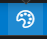

### 3. **theme-cycle.gif**
**Duration**: ~10 seconds  
**Steps**:
1. Open `.mmd` file
2. Click theme status bar icon 3-4 times
3. Show theme changing: Default → Dark → Forest → Neutral
4. Export one diagram to show theme applied

**Files needed**: `sample-chart.mmd`

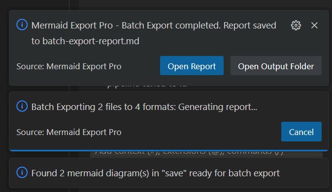

### 4. **batch-export.gif**
**Duration**: ~15 seconds  
**Steps**:
1. Show folder with 3-4 `.mmd` files
2. Command Palette → "Mermaid Export Pro - Export Folder"  
3. Select folder
4. Choose PNG format
5. Show multiple files exported

**Files needed**: `flowchart.mmd`, `sequence.mmd`, `gantt.mmd`

### 5. **markdown-export.gif**
**Duration**: ~12 seconds  
**Steps**:
1. Open `.md` file with 2-3 Mermaid blocks
2. Command Palette → "Export Markdown Diagrams"
3. Show multiple PNG files generated
4. Open one exported diagram

**Files needed**: `documentation.md` (with multiple diagrams)

### 6. **status-bar.gif**
**Duration**: ~8 seconds  
**Steps**:
1. Open `.mmd` file → Show status bars appear
2. Click main status bar → Show export options
3. Open `.txt` file → Show status bars hide
4. Return to `.mmd` → Show status bars reappear

**Files needed**: `example.mmd`, `readme.txt`

### 7. **auto-export.gif**
**Duration**: ~10 seconds  
**Steps**:
1. Command Palette → "Toggle Auto Export"
2. Edit `.mmd` file (add node)
3. Save (Ctrl+S)
4. Show PNG automatically updated in explorer

**Files needed**: `auto-test.mmd`

### 8. **settings.gif**
**Duration**: ~12 seconds  
**Steps**:
1. Open Settings → Extensions → Mermaid Export Pro
2. Change default format to SVG
3. Change theme to Dark
4. Export diagram → Show SVG with dark theme

**Files needed**: `settings-demo.mmd`

## 📸 Static Screenshots

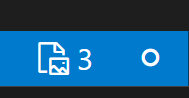

### 1. **status-bar-showcase.png**
- Show both status bars active with different states
- Capture: "🔧 2 Mermaids - Setup" + "🌙" (Dark theme icon)

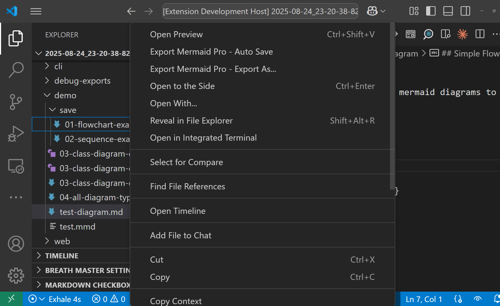

### 2. **right-click-menu.png**  
- Right-click context menu on `.mmd` file
- Show export options in context menu

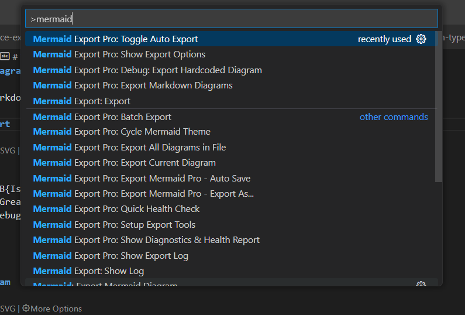

### 3. **command-palette.png**
- Command Palette open with "Mermaid Export Pro" commands visible
- Show all 11 commands listed

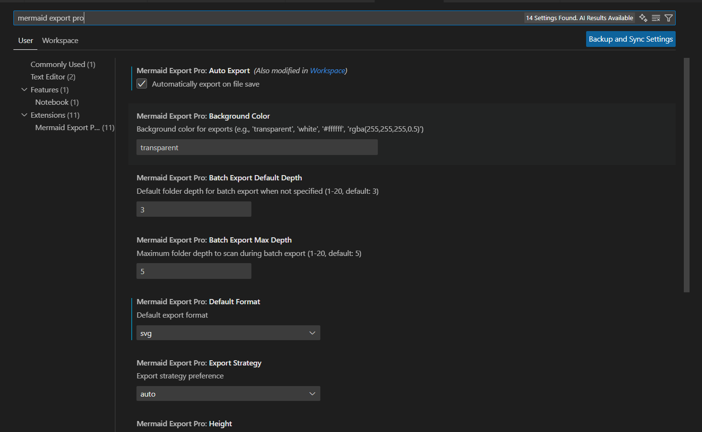

### 4. **settings-panel.png**
- VS Code settings with Mermaid Export Pro section expanded
- Show all configuration options


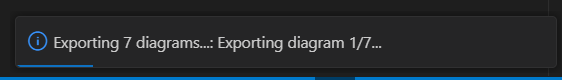

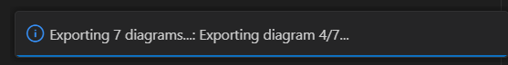

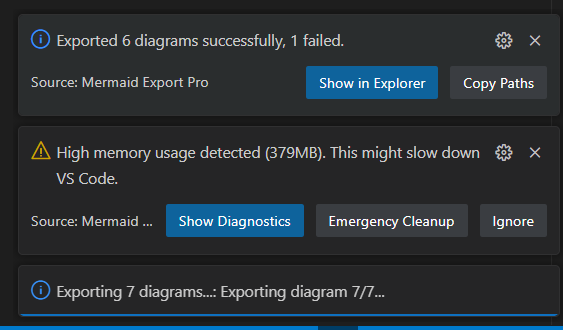

### 5. **export-progress.png**
- Progress notification during export
- Show "Exporting diagram..." with progress bar


### 6. **batch-export-picker.png**
- Folder picker dialog for Mermaid Export Pro - Export Folder
- Show file selection interface

## 📋 Required Demo Files

Create these files in your test workspace:

### **simple-flow.mmd**
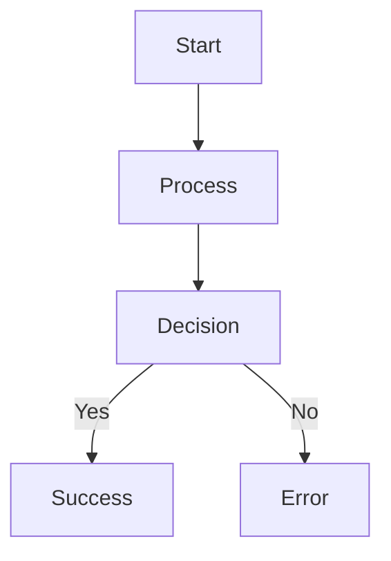

### **sample-chart.mmd**
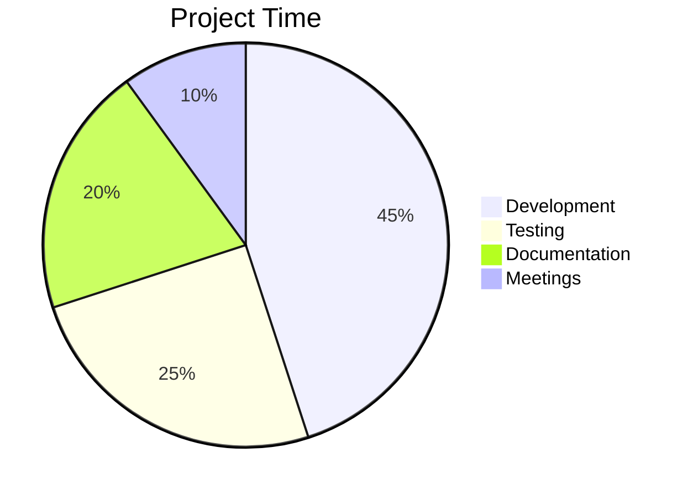

### **sequence.mmd**
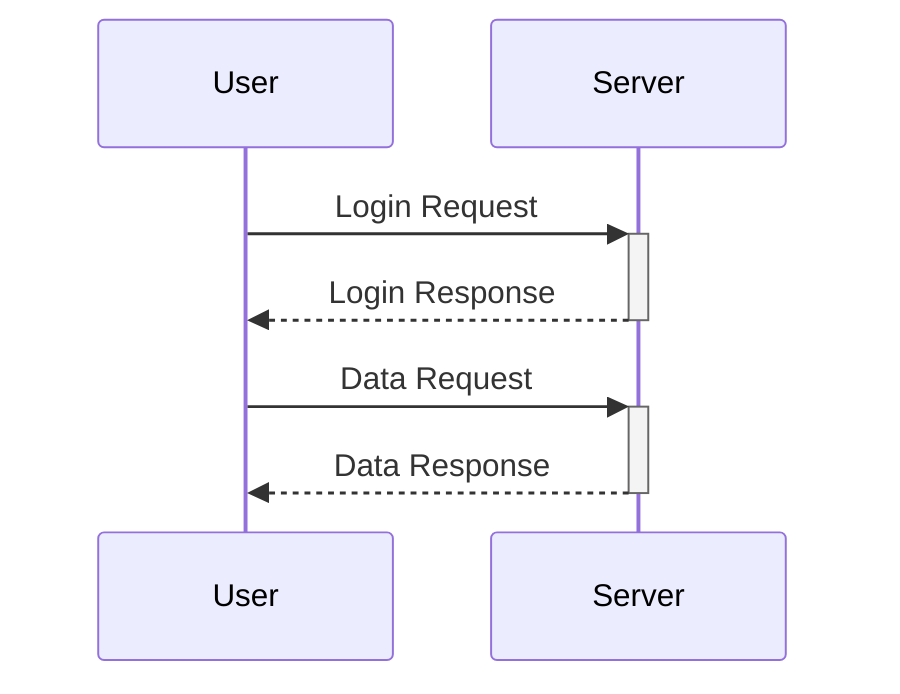

### **gantt.mmd**
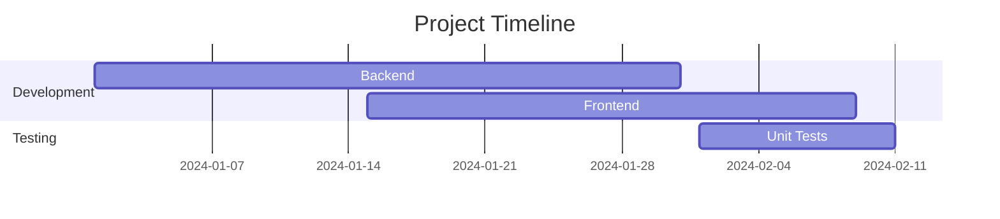

### **documentation.md**
```markdown
# Project Overview

## Architecture
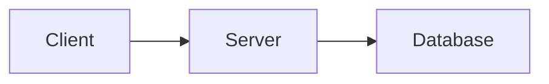

## User Flow
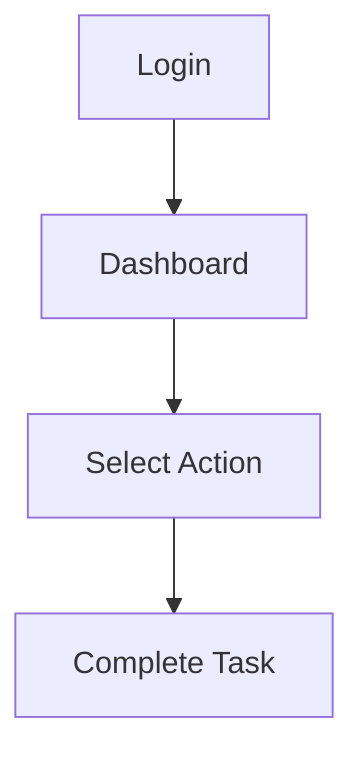

## Data Model
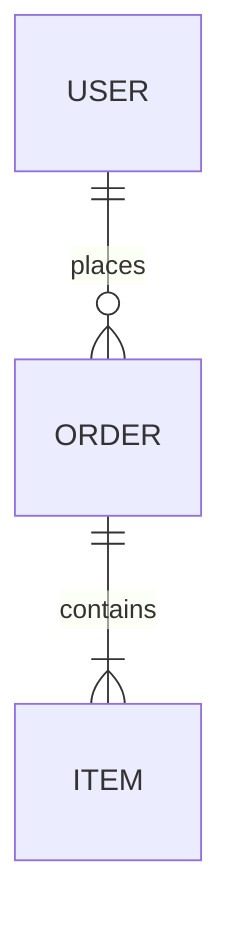
```

### **auto-test.mmd**
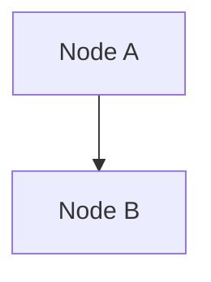

## 🎯 Recording Tips

### For GIFs:
- **Duration**: Keep under 15 seconds
- **Resolution**: 1280x720 or 1920x1080
- **Frame Rate**: 15-30 FPS
- **File Size**: Target under 5MB
- **Quality**: Balance between file size and clarity

### For Screenshots:
- **Resolution**: Native resolution (don't upscale)
- **Format**: PNG for UI elements
- **Cropping**: Focus on relevant UI areas
- **Annotations**: Add if needed for clarity

### VS Code Setup:
- **Theme**: Use default light theme for consistency
- **Font**: Default font size (14px)
- **Layout**: Simple layout, minimize distractions
- **Extensions**: Hide unrelated extensions in screenshots

## 📁 File Organization

```
demo-workspace/
├── diagrams/
│   ├── simple-flow.mmd
│   ├── sample-chart.mmd
│   ├── sequence.mmd
│   ├── gantt.mmd
│   └── auto-test.mmd
├── markdown/
│   └── documentation.md
└── outputs/
    └── (exported files appear here)
```

This structure provides a comprehensive showcase of all major features with minimal, focused demonstrations.