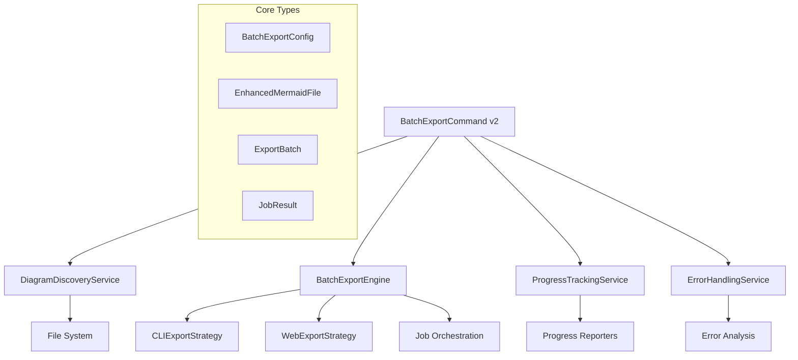

# Export Folder v2.0 - Architecture Documentation

## Overview

This document describes the completely redesigned export folder system for Mermaid Export Pro v2.0, built with modern software engineering principles including SOLID design, comprehensive testing, and maintainable architecture.

## Table of Contents

- [Architecture Overview](#architecture-overview)
- [Core Components](#core-components)
- [Service Layer](#service-layer)
- [Type System](#type-system)
- [Error Handling](#error-handling)
- [Progress Tracking](#progress-tracking)
- [Testing Strategy](#testing-strategy)
- [Performance Considerations](#performance-considerations)
- [Usage Examples](#usage-examples)

## Architecture Overview

### Design Principles

1. **Single Responsibility Principle**: Each service handles one specific concern
2. **Open/Closed Principle**: Services are extensible without modification
3. **Dependency Inversion**: High-level modules don't depend on low-level modules
4. **Interface Segregation**: Clients only depend on interfaces they use
5. **Testability**: All components are unit testable with mocked dependencies

### High-Level Architecture



### Key Improvements Over v1.0

| Aspect | v1.0 | v2.0 |
|--------|------|------|
| **Architecture** | Monolithic command | Service-oriented design |
| **Error Handling** | Basic try/catch | Comprehensive error service |
| **Progress Tracking** | Simple increments | Real-time analytics |
| **Multi-format Support** | Broken implementation | Full multi-format engine |
| **File Discovery** | Limited patterns | Advanced pattern matching |
| **Testing** | Minimal | Comprehensive test suites |
| **Type Safety** | Basic types | Rich type system |
| **Performance** | Single-threaded | Optimized job orchestration |

## Core Components

### 1. BatchExportCommand v2.0

**Location**: `src/commands/batchExportCommand.v2.ts`

The main orchestrator that provides user interface and coordinates all services.

#### Key Features:
- **Guided UI Flow**: 6-step configuration wizard
- **Smart Defaults**: Intelligent default selections based on workspace
- **Progress Integration**: Real-time progress with cancellation support
- **Result Presentation**: Comprehensive success/failure reporting

#### User Flow:
1. Source folder selection (workspace or custom)
2. Initial file discovery with preview
3. Format selection (all formats, presets, or custom)
4. Theme and styling configuration
5. Output organization options
6. Advanced settings (depth, overwrite policy)
7. Operation summary and confirmation
8. Tracked execution with progress reporting
9. Results presentation with reports

### 2. DiagramDiscoveryService

**Location**: `src/services/diagramDiscoveryService.ts`

Handles comprehensive file scanning and diagram analysis.

#### Features:
- **Advanced Pattern Matching**: Supports complex include/exclude patterns
- **Multi-format Support**: `.mmd`, `.md`, `.markdown` files
- **Case-insensitive Detection**: Handles `mermaid`, `Mermaid`, `MERMAID`
- **Diagram Analysis**: Type detection, complexity scoring, validation
- **Performance Optimized**: Caching and efficient scanning
- **Metadata Extraction**: File stats, encoding detection, line counts

#### Example Usage:
```typescript
const options: DiscoveryOptions = {
  rootDirectory: '/workspace',
  maxDepth: 3,
  includePatterns: ['*.md', '*.mmd'],
  excludePatterns: ['node_modules/**'],
  excludeDirectories: ['dist', '.git'],
  followSymlinks: false,
  caseSensitive: false
};

const files = await diagramDiscoveryService.discoverFiles(options);
```

### 3. BatchExportEngine

**Location**: `src/services/batchExportEngine.ts`

Core orchestration engine for multi-format export folders.

#### Key Capabilities:
- **Job Planning**: Creates optimized export jobs from files and config
- **Multi-format Support**: Handles any combination of formats
- **Execution Strategies**: Sequential, parallel, mixed, prioritized
- **Resource Management**: Memory and CPU optimization
- **Retry Logic**: Exponential backoff for failed jobs
- **Dependency Management**: Job dependency resolution

#### Execution Strategies:

| Strategy | Use Case | Performance |
|----------|----------|-------------|
| **Sequential** | Small batches, debugging | Predictable, slower |
| **Parallel** | Large batches, fast systems | Fastest, high memory |
| **Mixed** | Medium batches | Balanced performance |
| **Prioritized** | Complex dependencies | Optimized order |

#### Example Usage:
```typescript
const engine = createBatchExportEngine(context);
const batch = await engine.createBatch(files, config);
const result = await engine.executeBatch(batch, progressReporter);
```

### 4. ProgressTrackingService

**Location**: `src/services/progressTrackingService.ts`

Real-time progress monitoring with analytics and cancellation support.

#### Features:
- **Rich Progress Data**: Completion rates, timing estimates, performance metrics
- **Event-driven Updates**: Efficient subscriber pattern for UI updates
- **Memory Monitoring**: Alerts for high memory usage
- **Cancellation Support**: Graceful operation termination
- **Performance Analytics**: Throughput, job duration, system metrics
- **Auto-cleanup**: Prevents memory leaks from stale tracking data

#### Progress Data Structure:
```typescript
interface BatchProgress {
  batchId: string;
  overallProgress: number;
  currentJob?: ExportJob;
  completedJobs: number;
  totalJobs: number;
  jobCounts: {
    pending: number;
    running: number;
    completed: number;
    failed: number;
    skipped: number;
  };
  timing: {
    startedAt: Date;
    estimatedCompletion: Date;
    averageJobTime: number;
    remainingTime: number;
  };
  performance: {
    jobsPerSecond: number;
    totalThroughput: number;
    memoryUsage: number;
  };
}
```

### 5. ErrorHandlingService

**Location**: `src/services/errorHandlingService.ts`

Comprehensive error categorization, analysis, and recovery system.

#### Error Categories:
- **Retryable Errors**: Timeouts, network issues, resource unavailable
- **Configuration Errors**: Missing dependencies, invalid config, permissions
- **Content Errors**: Invalid syntax, unsupported diagrams, malformed input
- **System Errors**: Insufficient memory, disk full, system failures
- **Unknown Errors**: Unclassified errors with generic handling

#### Recovery Actions:
Each error category provides specific recovery suggestions:
```typescript
interface BatchExportError {
  code: string;
  message: string;
  severity: 'warning' | 'error' | 'critical';
  context: ErrorContext;
  originalError?: Error;
  recoveryActions: string[];
  retryable: boolean;
  details?: {
    stackTrace?: string;
    systemInfo?: SystemInfo;
    reproductionSteps?: string[];
  };
}
```

## Service Layer

### Service Interfaces

All services implement well-defined interfaces for testability and extensibility:

```typescript
// Core service interfaces
interface DiagramDiscoveryService {
  discoverFiles(options: DiscoveryOptions): Promise<EnhancedMermaidFile[]>;
  analyzeFile(filePath: string): Promise<EnhancedMermaidFile>;
  extractDiagrams(content: string, filePath: string): EnhancedMermaidDiagram[];
  validateDiagram(diagram: EnhancedMermaidDiagram): Promise<DiagramValidation>;
  calculateComplexity(diagram: EnhancedMermaidDiagram): DiagramComplexity;
}

interface BatchExportEngine {
  createBatch(files: EnhancedMermaidFile[], config: BatchExportConfig): Promise<ExportBatch>;
  executeBatch(batch: ExportBatch, reporter: ProgressReporter): Promise<BatchResult>;
  estimateDuration(batch: ExportBatch): Promise<number>;
  optimizeJobOrder(jobs: ExportJob[]): ExportJob[];
  validateBatch(batch: ExportBatch): Promise<ValidationError[]>;
}
```

### Dependency Injection

Services use constructor injection for dependencies:

```typescript
export class BatchExportEngineImpl implements BatchExportEngine {
  constructor(private context: vscode.ExtensionContext) {
    this.initializeStrategies();
  }
}
```

### Factory Pattern

Factory functions provide clean service instantiation:

```typescript
export function createBatchExportEngine(context: vscode.ExtensionContext): BatchExportEngine {
  return new BatchExportEngineImpl(context);
}
```

## Type System

### Enhanced Type Definitions

**Location**: `src/types/batchExport.ts`

The new type system provides comprehensive type safety and rich metadata:

#### Core Types:
- **`BatchExportConfig`**: Complete batch configuration
- **`EnhancedMermaidFile`**: File with metadata and analysis
- **`EnhancedMermaidDiagram`**: Diagram with type analysis and complexity
- **`ExportBatch`**: Complete batch specification
- **`BatchResult`**: Comprehensive execution results

#### Type Safety Benefits:
- **Compile-time Validation**: TypeScript catches type errors during development
- **IntelliSense Support**: Full auto-completion in VS Code
- **Documentation**: Types serve as living documentation
- **Refactoring Safety**: Changes propagate through type system

### Advanced Type Features

#### Union Types for Configuration:
```typescript
type FileNamingStrategy = 'sequential' | 'descriptive' | 'lineNumber' | 'custom';
type BatchExecutionStrategy = 'sequential' | 'parallel' | 'mixed' | 'prioritized';
```

#### Rich Metadata Types:
```typescript
interface DiagramComplexity {
  nodeCount: number;
  connectionCount: number;
  depth: number;
  score: number;
  category: 'simple' | 'moderate' | 'complex' | 'very-complex';
  estimatedRenderTime: number;
}
```

#### Comprehensive Result Types:
```typescript
interface BatchResult {
  batch: ExportBatch;
  success: boolean;
  jobResults: JobResult[];
  summary: BatchSummary;
  errors: BatchExportError[];
  performance: PerformanceMetrics;
  outputs: OutputOrganization;
  timeline: ExecutionTimeline;
}
```

## Error Handling

### Error Architecture

The error handling system follows a layered approach:

1. **Error Detection**: Services catch and classify errors
2. **Error Processing**: ErrorHandlingService analyzes and enriches errors
3. **Error Presentation**: UI displays user-friendly messages and recovery options
4. **Error Recovery**: Automated retry logic and user-guided recovery

### Error Classification

Errors are automatically classified using pattern matching:

```typescript
const errorPatterns: ErrorPattern[] = [
  {
    category: ErrorCategory.TIMEOUT,
    patterns: [/timeout/i, /timed out/i],
    retryable: true,
    severity: 'warning',
    recoveryActions: ['Increase timeout settings', 'Try fewer files at once']
  },
  // ... more patterns
];
```

### Error Reporting

Comprehensive error reports are generated automatically:

```typescript
const report = errorHandlingService.generateErrorReport(errors);
// Creates detailed Markdown report with:
// - Error summary by category
// - System information
// - Recovery recommendations
// - Reproduction steps
```

## Progress Tracking

### Real-time Updates

Progress tracking provides detailed real-time information:

```typescript
interface BatchProgress {
  overallProgress: number;           // 0-1 completion ratio
  currentJob?: ExportJob;           // Currently executing job
  completedJobs: number;            // Jobs finished
  jobCounts: JobCountsByStatus;     // Detailed job status breakdown
  timing: TimingInformation;        // Duration estimates
  performance: PerformanceMetrics;  // Throughput and resource usage
}
```

### Event-driven Architecture

Progress updates use an efficient event system:

```typescript
progressTrackingService.onProgress(batchId, (progress) => {
  // Update UI with latest progress
  updateProgressBar(progress.overallProgress);
  updateCurrentOperation(progress.currentOperation.message);
});
```

### Cancellation Support

Operations can be cancelled gracefully:

```typescript
token.onCancellationRequested(() => {
  progressTrackingService.cancel(operationId);
});
```

## Testing Strategy

### Test Architecture

The testing strategy covers multiple layers:

1. **Unit Tests**: Test individual service methods in isolation
2. **Integration Tests**: Test service interactions with mocked dependencies
3. **Performance Tests**: Validate performance characteristics
4. **Error Scenario Tests**: Test error handling and recovery

### Test Files Structure

```
src/test/
├── services/
│   ├── diagramDiscoveryService.test.ts
│   ├── batchExportEngine.test.ts
│   ├── progressTrackingService.test.ts
│   └── errorHandlingService.test.ts
├── commands/
│   └── batchExportCommand.test.ts
└── integration/
    └── fullBatchExport.test.ts
```

### Mock Strategy

Services use dependency injection for easy mocking:

```typescript
// Mock VS Code context for testing
const mockContext = {
  extensionPath: __dirname,
  globalState: new MockGlobalState(),
  workspaceState: new MockWorkspaceState()
} as vscode.ExtensionContext;

// Mock progress reporter
class MockProgressReporter implements ProgressReporter {
  updateProgress(progress: BatchProgress): void { /* mock */ }
  setPhase(phase: BatchPhase, message: string): void { /* mock */ }
  // ... other methods
}
```

### Test Examples

#### Discovery Service Tests:
```typescript
describe('DiagramDiscoveryService', () => {
  it('should discover .mmd files', async () => {
    const files = await service.discoverFiles(options);
    assert.ok(files.length > 0, 'Should find .mmd files');
    assert.ok(files.every(f => f.type === 'mmd'));
  });

  it('should extract multiple diagrams from markdown', async () => {
    const result = await service.analyzeFile('multi-diagram.md');
    assert.strictEqual(result.diagrams.length, 2);
  });
});
```

#### Engine Tests:
```typescript
describe('BatchExportEngine', () => {
  it('should create batch with proper job distribution', async () => {
    const batch = await engine.createBatch(mockFiles, config);
    const expectedJobs = mockFiles.length * config.formats.length;
    assert.strictEqual(batch.jobs.length, expectedJobs);
  });
});
```

## Performance Considerations

### Optimization Strategies

1. **Lazy Loading**: Services load resources only when needed
2. **Caching**: File analysis results are cached to avoid recomputation
3. **Streaming Processing**: Large batches are processed in chunks
4. **Memory Management**: Automatic cleanup prevents memory leaks
5. **Parallel Execution**: CPU-bound tasks run in parallel when beneficial

### Performance Monitoring

Built-in performance monitoring tracks:
- **Memory Usage**: Heap usage and peak consumption
- **CPU Time**: Processing time per job and total
- **Throughput**: Jobs processed per second
- **I/O Operations**: File system access patterns

### Scalability

The architecture scales to handle:
- **Large Workspaces**: 1000+ files with optimized scanning
- **Complex Diagrams**: Multi-format exports of complex diagrams
- **Concurrent Operations**: Multiple export folders (with resource limits)
- **Long-running Operations**: Progress tracking prevents UI blocking

## Usage Examples

### Basic Export Folder

```typescript
import { runBatchExport } from './commands/batchExportCommand.v2';

// Register command in extension activation
context.subscriptions.push(
  vscode.commands.registerCommand(
    'mermaidExportPro.batchExport',
    (folderUri) => runBatchExport(context, folderUri)
  )
);
```

### Programmatic Usage

```typescript
import { diagramDiscoveryService } from './services/diagramDiscoveryService';
import { createBatchExportEngine } from './services/batchExportEngine';

// Discover files
const files = await diagramDiscoveryService.discoverFiles({
  rootDirectory: '/workspace',
  maxDepth: 3,
  includePatterns: ['*.md', '*.mmd'],
  excludePatterns: ['node_modules/**']
});

// Create batch
const engine = createBatchExportEngine(context);
const batch = await engine.createBatch(files, {
  formats: ['svg', 'png'],
  theme: 'default',
  outputDirectory: '/output',
  namingStrategy: 'sequential',
  organizeByFormat: true
});

// Execute with progress tracking
const reporter = progressTrackingService.createReporter(batch.id);
const result = await engine.executeBatch(batch, reporter);

console.log(`Exported ${result.summary.successfulJobs} diagrams`);
```

### Custom Error Handling

```typescript
try {
  await runBatchExport(context, folderUri);
} catch (error) {
  const batchError = errorHandlingService.handleError(error, {
    operation: 'custom-batch',
    phase: 'execution'
  });
  
  console.log('Error:', batchError.message);
  console.log('Recovery actions:', batchError.recoveryActions);
  
  if (batchError.retryable) {
    // Implement retry logic
  }
}
```

## Migration from v1.0

### Breaking Changes

1. **API Changes**: New command signature and service interfaces
2. **Configuration Format**: Enhanced configuration with more options
3. **Error Handling**: Different error types and recovery mechanisms
4. **Progress Events**: New progress event structure

### Migration Guide

#### Command Registration:
```typescript
// Old v1.0
vscode.commands.registerCommand('mermaidExportPro.batchExport', runBatchExport);

// New v2.0
vscode.commands.registerCommand('mermaidExportPro.batchExportV2', runBatchExportV2);
```

#### Configuration Updates:
```typescript
// Old v1.0 config (limited)
interface OldBatchConfig {
  format: ExportFormat;
  theme: MermaidTheme;
  outputPath: string;
}

// New v2.0 config (comprehensive)
interface BatchExportConfig {
  formats: ExportFormat[];           // Multiple formats
  theme: MermaidTheme;
  backgroundColor?: string;          // Custom background
  outputDirectory: string;
  namingStrategy: FileNamingStrategy; // Flexible naming
  organizeByFormat: boolean;         // Output organization
  overwriteExisting: boolean;        // Overwrite policy
  maxDepth: number;                  // Discovery depth
  dimensions?: Dimensions;           // Custom dimensions
}
```

### Coexistence Strategy

Both versions can coexist during migration:

```typescript
// Register both commands
context.subscriptions.push(
  vscode.commands.registerCommand('mermaidExportPro.batchExport', runBatchExportV1),
  vscode.commands.registerCommand('mermaidExportPro.batchExportV2', runBatchExportV2)
);
```

## Future Enhancements

### Planned Features

1. **Custom Export Strategies**: Plugin system for new export formats
2. **Diagram Preprocessing**: Content transformation before export
3. **Export Templates**: Predefined configurations for common use cases
4. **Cloud Storage Integration**: Direct export to cloud storage services
5. **Collaborative Features**: Shared export configurations and results
6. **Advanced Analytics**: Export usage statistics and optimization suggestions

### Extensibility Points

The architecture provides several extensibility points:

1. **Export Strategies**: Implement new export backends
2. **Discovery Patterns**: Add support for new file formats
3. **Error Handlers**: Custom error processing and recovery
4. **Progress Reporters**: Custom progress visualization
5. **Naming Strategies**: Custom file naming patterns

### Plugin Architecture

Future plugin system design:

```typescript
interface ExportPlugin {
  name: string;
  version: string;
  formats: ExportFormat[];
  initialize(context: vscode.ExtensionContext): Promise<void>;
  createStrategy(): ExportStrategy;
}

// Plugin registration
batchExportEngine.registerPlugin(new MyCustomPlugin());
```

## Conclusion

The Export Folder v2.0 architecture represents a complete redesign focused on:

- **Maintainability**: Clean service separation and comprehensive testing
- **Reliability**: Robust error handling and recovery mechanisms
- **Performance**: Optimized processing and resource management
- **User Experience**: Guided workflows and detailed progress reporting
- **Extensibility**: Plugin-ready architecture for future enhancements

This architecture provides a solid foundation for current export folder needs while being extensible for future requirements. The comprehensive type system, testing coverage, and documentation ensure long-term maintainability and developer productivity.