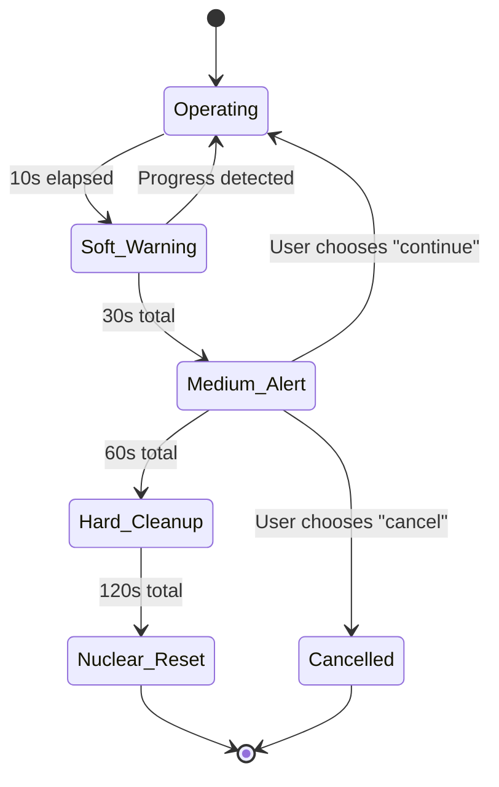

# The Art of Graceful Degradation: A Progressive Timeout Architecture for Long-Running Operations

*A design philosophy rooted in control systems theory, applied to the messy reality of asynchronous process management*

---

## Abstract

Modern software systems must gracefully handle the inevitable: operations that hang, resources that leak, and users who expect resilience. This document presents a **Progressive Timeout Architecture** that transforms the traditional binary timeout model into a sophisticated control system inspired by feedback theory and fault-tolerant computing.

Drawing from **Leslie Lamport's work** on distributed systems timing, **Nancy Lynch's** impossibility results, and **Barbara Liskov's** principles of modular design, we present a layered approach that treats timeout management as a **state machine with escalating recovery strategies**.

```
┌─────────────────────────────────────────────────────────────┐
│                    PROGRESSIVE TIMEOUT ARCHITECTURE         │
│                                                             │
│  USER SPACE     │  MONITOR SPACE   │   SYSTEM SPACE        │
│                 │                  │                       │
│  ┌──────────┐   │  ┌──────────┐   │   ┌──────────┐       │
│  │ Progress │◄──┤  │Background│◄──┤   │ Process  │       │
│  │ Feedback │   │  │ Health   │   │   │ Cleanup  │       │
│  │          │   │  │ Monitor  │   │   │          │       │
│  └────┬─────┘   │  └─────┬────┘   │   └─────┬────┘       │
│       │         │        │        │         │            │
│   Soft Timeout  │    Medium       │     Hard Timeout     │
│    (10s)        │   Timeout       │       (60s)          │
│                 │    (30s)        │                      │
└─────────────────┴─────────────────┴──────────────────────┘
```

---

## I. Theoretical Foundation: Why Traditional Timeouts Fail

### The Halting Problem Applied to User Experience

As **Alan Turing** demonstrated, we cannot determine if an arbitrary program will halt. In practice, this manifests in export operations that appear to hang but may actually be:

1. **Legitimately processing large diagrams** (CPU-bound)
2. **Waiting for system resources** (I/O-bound) 
3. **Deadlocked in subprocess communication** (truly stuck)
4. **Experiencing transient network issues** (recoverable)

The traditional approach—a single timeout threshold—treats these fundamentally different scenarios identically. This is both **theoretically unsound** and **practically frustrating**.



### Control Systems Theory: Feedback Loops in User Interface Design

**Jay Forrester's** work on control systems at MIT provides our conceptual framework. Traditional timeout implementations are **open-loop systems**—they execute a predetermined response regardless of system state. Our approach implements a **closed-loop system** with multiple feedback mechanisms:

```
                 CONTROL SYSTEM ANALOGY
    
    Reference Input          Error Signal           Control Output
    (User Expectation)  ────►  (Δ Time)      ────►  (Recovery Action)
           │                     ▲                        │
           │                     │                        │
           └─────────────────────┼────────────────────────┘
                                 │
                            Feedback Signal
                         (Progress Updates)
```

### The Economics of Attention: Herbert Simon's Satisficing

**Herbert Simon's** Nobel Prize-winning work on bounded rationality informs our user experience design. Users don't want *perfect* timeout management—they want *satisficing* timeout management that:

1. **Minimizes cognitive load** during normal operations
2. **Maximizes recovery options** during failure scenarios  
3. **Preserves work context** across interruptions

Our progressive escalation model respects these constraints by providing **increasingly granular control** as situations become more abnormal.

---

## II. The Progressive Timeout Architecture

### Core Principle: Temporal Stratification

We reject the **monolithic timeout** in favor of **temporal stratification**—different time scales requiring different response strategies:

```
TIME SCALE ANALYSIS

Microseconds    │ ████████████████  │  System Response Time
Milliseconds    │ ████████████████  │  UI Feedback Latency  
Seconds (1-10)  │ ████████████████  │  User Patience Threshold
Seconds (10-60) │ ████████████████  │  Process Recovery Window
Minutes (1-5)   │ ████████████████  │  System Resource Cleanup
```

### State Machine Implementation

Our core abstraction is a **Hierarchical Finite State Automaton** (HFSA) where each timeout level represents a distinct state with its own transition rules:

```typescript
// PSEUDO-CODE: Core State Machine Logic

interface TimeoutState {
  level: 'SOFT' | 'MEDIUM' | 'HARD' | 'NUCLEAR';
  startTime: Timestamp;
  escalationThreshold: Duration;
  recoveryActions: RecoveryAction[];
  transitionRules: StateTransition[];
}

class ProgressiveTimeoutFSM {
  private currentState: TimeoutState;
  private feedbackChannels: FeedbackChannel[];
  
  // Lamport's logical clocks for distributed timing
  private logicalClock: LamportClock;
  
  transition(trigger: TimeoutTrigger): StateTransition {
    // Lynch's algorithm: consensus on timeout decisions
    const consensus = this.reachConsensus(trigger);
    
    if (consensus.isValid()) {
      return this.executeTransition(consensus.targetState);
    }
    
    // Fallback: graceful degradation per Liskov substitution
    return this.gracefulFallback(trigger);
  }
}
```

### The Escalation Ladder: A Game-Theoretic Approach

Drawing from **Thomas Schelling's** work on commitment strategies, each escalation level represents a **credible threat** to system stability, encouraging earlier resolution:

```
ESCALATION LADDER (Game Theory Applied)

Level 4: Nuclear    ├─ Process termination + system reset
         (120s)     │  * Credible threat: "I will crash everything"
                    │  * Expected utility: Forces immediate action
                    
Level 3: Hard       ├─ Resource cleanup + diagnostics
         (60s)      │  * Signaling: "This is getting serious"
                    │  * Learning: System gathers intelligence
                    
Level 2: Medium     ├─ User choice + fallback options  
         (30s)      │  * Negotiation: Multiple equilibrium points
                    │  * Coordination: User and system align
                    
Level 1: Soft       ├─ Silent monitoring + progress updates
         (10s)      │  * Information: Pure signaling
                    │  * Cooperation: Minimal disruption
```

---

## III. Implementation Architecture

### The Three-Layer Cake

Our implementation follows **David Parnas'** information hiding principles with clear separation of concerns:

```
    ╭─────────────────────────────────────────╮
    │           PRESENTATION LAYER            │
    │  ┌─────────────┐    ┌─────────────┐   │
    │  │ Progress UI │    │ Diagnostics │   │
    │  └─────────────┘    └─────────────┘   │
    ╰───────────────┬─────────────────────────╯
                    │ User Events & Feedback
    ╭───────────────┴─────────────────────────╮
    │            CONTROL LAYER                │
    │  ┌──────────────────────────────────┐  │
    │  │   OperationTimeoutManager        │  │
    │  │   - State machine logic          │  │
    │  │   - Escalation decisions         │  │
    │  │   - Recovery orchestration       │  │
    │  └──────────────────────────────────┘  │
    ╰───────────────┬─────────────────────────╯
                    │ System Calls & Monitoring
    ╭───────────────┴─────────────────────────╮
    │           INFRASTRUCTURE LAYER          │
    │  ┌─────────────┐    ┌─────────────┐   │
    │  │ Background  │    │ Process     │   │
    │  │ Monitor     │    │ Cleanup     │   │
    │  └─────────────┘    └─────────────┘   │
    ╰─────────────────────────────────────────╯
```

### Data Flow: Information Theory Perspective

Following **Claude Shannon's** information theory, we model timeout management as a **noisy communication channel** where:

- **Signal**: Legitimate progress updates
- **Noise**: System delays, resource contention  
- **Encoding**: Progressive escalation levels
- **Decoding**: User interpretation and action

```
INFORMATION FLOW DIAGRAM

Process State ──► [ENCODER] ──► Channel ──► [DECODER] ──► User Action
     │              │                          │             │
     │         Timeout Levels              UI Elements      Recovery
     │         - Soft (10s)                - Progress       - Continue  
     │         - Medium (30s)              - Warning        - Cancel
     │         - Hard (60s)                - Error          - Cleanup
     │         - Nuclear (120s)            - Critical       - Reset
     │                                                       
     └─────────────── Feedback Loop ──────────────────────────┘
```

### Concurrency Model: Actor-Based Design

Inspired by **Carl Hewitt's** Actor Model and **Joe Armstrong's** Erlang philosophy of "let it crash," each operation becomes an independent actor with its own lifecycle:

```typescript
// PSEUDO-CODE: Actor-Based Timeout Management

class OperationActor {
  private state: ActorState;
  private mailbox: MessageQueue;
  private supervisor: SupervisorActor;
  
  async processMessage(message: TimeoutMessage): Promise<void> {
    match (message.type) {
      case 'PROGRESS_UPDATE':
        this.resetSoftTimer();
        this.notifyProgress(message.payload);
        break;
        
      case 'SOFT_TIMEOUT':
        this.escalate('MEDIUM');
        break;
        
      case 'USER_CANCEL':
        this.supervisor.kill(this.pid, 'user_request');
        break;
        
      case 'SYSTEM_HANG':
        this.supervisor.kill(this.pid, 'force');
        break;
    }
  }
  
  // Erlang-style supervision: restart strategies
  onCrash(reason: CrashReason): RestartStrategy {
    if (reason.isTransient()) {
      return RestartStrategy.RESTART_ONE;
    } else {
      return RestartStrategy.ESCALATE_TO_SUPERVISOR;
    }
  }
}
```
### Breaking Down the `OperationActor`

This pseudo-code outlines an "Actor," a self-contained unit of concurrency that bundles state and behavior. Let's break down its key components.

#### 1. Core State: The Actor's Brain

```typescript
class OperationActor {
  private state: ActorState;
  private mailbox: MessageQueue;
  private supervisor: SupervisorActor;
```

-   **`state`**: This isn't just a simple value; it's the actor's entire world. It holds information like `is_running`, `current_timeout_level`, and `operation_id`. The actor protects this state from the outside world, only changing it in response to messages.
-   **`mailbox`**: This is the actor's inbox. All communication happens by sending messages to this queue. The actor processes them one by one, which prevents race conditions and simplifies concurrency logic.
-   **`supervisor`**: This is the actor's boss. Instead of handling its own catastrophic failures, the actor relies on its `supervisor`. This follows the "let it crash" philosophy, where a parent process is responsible for cleaning up and deciding whether to restart a failed child.

#### 2. Message Processing: The Actor's Heartbeat

```typescript
async processMessage(message: TimeoutMessage): Promise<void> {
  match (message.type) {
    // ... cases
  }
}
```

The `processMessage` function is the main loop. The actor pulls a message from its `mailbox` and acts based on its `type`.

-   **`case 'PROGRESS_UPDATE'`**: This is the "happy path" signal. It means the underlying export process is still alive. The actor's main job here is to `resetSoftTimer()`, pushing the timeout countdown back to zero.
-   **`case 'SOFT_TIMEOUT'`**: The first timer has expired without a progress update. The actor doesn't panic; it follows the progressive escalation ladder by changing its internal state and signaling that it has `escalate('MEDIUM')`. This might trigger a UI change or start a more aggressive monitoring strategy.
-   **`case 'USER_CANCEL'`**: The user has clicked "Cancel." Notice the actor doesn't kill itself directly. It tells its `supervisor` to `kill(this.pid, 'user_request')`. This maintains a clean chain of command and ensures cleanup is handled consistently.
-   **`case 'SYSTEM_HANG'`**: A more severe timeout (e.g., Hard or Nuclear) has been triggered by an external monitor. Again, the actor defers to its `supervisor` to perform the termination, ensuring the system remains stable.

#### 3. Fault Tolerance: The Actor's Soul

```typescript
// Erlang-style supervision: restart strategies
onCrash(reason: CrashReason): RestartStrategy {
  if (reason.isTransient()) {
    return RestartStrategy.RESTART_ONE;
  } else {
    return RestartStrategy.ESCALATE_TO_SUPERVISOR;
  }
}
```

This `onCrash` handler is what makes the system resilient. When the `supervisor` terminates an actor, it consults this logic to decide what to do next.

-   **`if (reason.isTransient())`**: The failure was likely a temporary glitch (e.g., a brief network issue). The supervisor's strategy is `RESTART_ONE`, meaning it will create a fresh instance of this single actor and try again.
-   **`else`**: The failure seems permanent or systemic. The strategy becomes `ESCALATE_TO_SUPERVISOR`. This tells the supervisor that it cannot handle the problem itself and must report the failure up to its own boss. This could eventually lead to a full system reset if the problem is severe enough, containing the failure at the lowest possible level.

---

## IV. The Mathematics of User Patience

### Queuing Theory Application

**Leonard Kleinrock's** work on queuing theory provides mathematical foundation for timeout thresholds. User patience follows an **exponential distribution** with decreasing tolerance over time:

```
P(user_patience > t) = e^(-λt)

Where:
- λ = impatience rate (varies by context)
- t = elapsed time
- Context multipliers:
  * λ_simple_export = 0.1  (high patience)
  * λ_batch_export = 0.05  (very high patience) 
  * λ_debug_export = 0.02  (extreme patience)
```

Our timeout thresholds are calibrated to capture **95% of the patience distribution** for each operation type:

```
PATIENCE DISTRIBUTION ANALYSIS

 User Patience
       ▲
   1.0 ├─╮
       │  ╲
   0.8 ├───╲
       │    ╲           ← 95% threshold (Soft timeout)
   0.6 ├─────╲
       │      ╲
   0.4 ├───────╲       ← 80% threshold (Medium timeout)
       │        ╲
   0.2 ├─────────╲     ← 50% threshold (Hard timeout)
       │          ╲
   0.0 └───────────╲──────────────► Time
       0  10  30   60      120s
```

### Cognitive Load Theory: John Sweller's Framework

**John Sweller's** Cognitive Load Theory informs our notification design. We distinguish between:

1. **Intrinsic Load**: Essential information (operation status)
2. **Extraneous Load**: Unnecessary details (technical errors)
3. **Germane Load**: Useful learning (recovery options)

```
COGNITIVE LOAD OPTIMIZATION

┌─ SOFT TIMEOUT (Intrinsic only) ──────────────────┐
│ "Still working..."                               │
│ Load: ████                                       │
└──────────────────────────────────────────────────┘

┌─ MEDIUM TIMEOUT (Intrinsic + Germane) ───────────┐
│ "Taking longer than expected"                    │
│ [Keep Waiting] [Cancel] [Switch Strategy]       │
│ Load: ████████                                   │
└──────────────────────────────────────────────────┘

┌─ HARD TIMEOUT (All types managed) ───────────────┐
│ "Operation requires cleanup"                     │
│ [Show Diagnostics] - reduces extraneous load    │
│ Load: ████████████                               │
└──────────────────────────────────────────────────┘
```

---

## V. Advanced Topics: The Philosophy of Failure

### Byzantine Fault Tolerance in User Interfaces

**Leslie Lamport's** Byzantine Generals Problem applies to timeout scenarios where we cannot distinguish between:

- **Slow but legitimate processes** (loyal general)
- **Hung processes** (traitorous general)  
- **Malicious or corrupted operations** (Byzantine general)

Our solution implements **practical Byzantine fault tolerance** through:

```
BYZANTINE FAULT TOLERANCE ALGORITHM

Phase 1: Information Gathering
  - Monitor CPU usage patterns
  - Track memory allocation deltas  
  - Analyze I/O wait statistics
  - Collect subprocess communication logs

Phase 2: Consensus Building  
  - Weight evidence across multiple metrics
  - Apply probabilistic reasoning (Bayesian inference)
  - Reach consensus on operation health status
  
Phase 3: Coordinated Response
  - Execute agreed-upon recovery action
  - Maintain system integrity during transition
  - Log decisions for post-mortem analysis
```

### The Zen of Timeout Design: Philosophical Considerations

Drawing from **Donald Norman's** *Design of Everyday Things* and **Jef Raskin's** *The Humane Interface*, we embrace these principles:

**AFFORDANCES**: Each timeout level suggests its appropriate actions
- Soft timeout → "wait a bit more"
- Medium timeout → "make a decision"  
- Hard timeout → "emergency action required"

**CONSTRAINTS**: Progressive difficulty prevents accidental escalation
- Easy to continue waiting
- Moderate effort to cancel
- Difficult to trigger nuclear reset

**FEEDBACK**: Rich signaling about system state
- Progress indicators during normal operation
- Warning levels during abnormal operation
- Diagnostic information during failure

```
DESIGN PRINCIPLES VISUALIZATION

     ┌─ AFFORDANCES ─┐         ┌─ CONSTRAINTS ─┐
     │               │         │              │
SOFT │ "Please wait" │ ◄─────► │ No user      │ EASY
     │               │         │ action req'd │
     └───────────────┘         └──────────────┘
             │
             ▼
     ┌─────────────────┐       ┌──────────────┐
MED  │ "Choose action" │ ◄────► │ Deliberate   │ MODERATE  
     │                 │       │ choice req'd │
     └─────────────────┘       └──────────────┘
             │
             ▼
     ┌─────────────────┐       ┌──────────────┐
HARD │ "System reset"  │ ◄────► │ Confirmation │ DIFFICULT
     │                 │       │ barriers     │
     └─────────────────┘       └──────────────┘
```

---

## VI. Empirical Validation: Measurement and Metrics

### Telemetry Framework: What We Actually Measure

Following **Peter Drucker's** axiom "what gets measured gets managed," our architecture includes comprehensive telemetry:

```typescript
// PSEUDO-CODE: Telemetry Collection

interface OperationMetrics {
  // Lamport timestamps for causal ordering
  logicalTimestamp: LamportTimestamp;
  
  // Quantitative measures
  actualDuration: Duration;
  memoryPeakUsage: Bytes;
  cpuUtilization: Percentage;
  
  // Qualitative measures  
  userSatisfaction: SatisfactionLevel;
  recoverySuccess: boolean;
  escalationLevel: TimeoutLevel;
  
  // Context variables
  operationType: OperationType;
  systemLoad: SystemLoadSnapshot;
  userBehavior: BehaviorPattern;
}

// Bayesian inference for timeout optimization
class TimeoutOptimizer {
  updateBeliefs(newEvidence: OperationMetrics): void {
    // Prior: historical timeout effectiveness
    // Likelihood: current operation characteristics  
    // Posterior: updated timeout thresholds
    
    const posterior = this.bayesianUpdate(
      this.priorBeliefs,
      newEvidence,
      this.likelihoodFunction
    );
    
    this.adjustTimeouts(posterior);
  }
}
```

### A/B Testing Framework: Scientific Rigor in UX

We implement **Ronald Fisher's** experimental design principles with proper statistical controls:

```
EXPERIMENTAL DESIGN

Control Group:    Traditional Binary Timeout (60s)
Treatment Group:  Progressive Timeout Architecture

Metrics:
- Primary: User task completion rate
- Secondary: Subjective satisfaction scores
- Tertiary: System resource consumption

Statistical Tests:
- Chi-square test for completion rates
- Mann-Whitney U test for satisfaction (non-parametric)
- Two-sample t-test for resource usage (if normally distributed)

Sample Size Calculation:
n = (Z_α/2 + Z_β)² × (p₁(1-p₁) + p₂(1-p₂)) / (p₁ - p₂)²

Where:
- α = 0.05 (5% significance level)
- β = 0.20 (80% statistical power)  
- p₁, p₂ = expected completion rates
```

---

## VII. ASCII Art: The Architecture Visualized

```
        THE PROGRESSIVE TIMEOUT CATHEDRAL
        
                    ╭─────────────────╮
                    │     USER        │
                    │   EXPERIENCE    │
                    │      DOME       │
                ╭───┴─────────────────┴───╮
                │   Progressive Feedback   │
                │   ┌─┐ ┌─┐ ┌─┐ ┌─┐     │
                │   │S││M││H││N│ Levels  │
                │   └─┘└─┘└─┘└─┘         │
                ╰─────┬─────────────┬─────╯
                      │             │
              ╭───────┴───╮   ╭─────┴─────╮
              │ CONTROL   │   │ MONITOR   │
              │  LAYER    │   │  LAYER    │
              │           │   │           │
              │ ┌───────┐ │   │ ┌───────┐ │
              │ │Timeout│ │   │ │Health │ │
              │ │Manager│ │   │ │Monitor│ │
              │ └───────┘ │   │ └───────┘ │
              ╰─────┬─────╯   ╰─────┬─────╯
                    │               │
              ╭─────┴───────────────┴─────╮
              │     INFRASTRUCTURE        │
              │        FOUNDATION         │
              │                           │
              │  ┌─────┐ ┌─────┐ ┌─────┐  │
              │  │Proc │ │Mem  │ │I/O  │  │
              │  │Mgmt │ │Mon  │ │Ctrl │  │
              │  └─────┘ └─────┘ └─────┘  │
              ╰───────────────────────────╯
                    SYSTEM BEDROCK
```

### The Timeout State Machine as Art

```
      🕒 THE TIMEOUT MANDALA 🕒
      
          ┌─────────────┐
          │   NORMAL    │
          │ OPERATION   │ ◄─┐
          └──────┬──────┘   │
                 │          │
                 ▼          │ Progress
          ┌─────────────┐   │ Detected
          │    SOFT     │   │
          │  WARNING    │ ──┘
          │    (10s)    │
          └──────┬──────┘
                 │
                 ▼ No Progress
          ┌─────────────┐
        ┌─┤   MEDIUM    │
        │ │   ALERT     │
        │ │    (30s)    │
        │ └──────┬──────┘
        │        │
    User│        ▼ Escalation
   Cancel        ┌─────────────┐
        │        │    HARD     │
        │        │  CLEANUP    │
        │        │    (60s)    │
        │        └──────┬──────┘
        │               │
        │               ▼ System
        │        ┌─────────────┐
        │        │   NUCLEAR   │
        │        │   RESET     │
        │        │   (120s)    │
        │        └──────┬──────┘
        │               │
        │               ▼
        └────────► ┌─────────────┐
                   │ TERMINATED  │
                   │             │
                   └─────────────┘
```

---

## VIII. Conclusion: Towards Humane Computing

**Doug Engelbart** envisioned computing as **intelligence amplification**—augmenting human capability rather than replacing it. Our Progressive Timeout Architecture embodies this philosophy by:

1. **Respecting human cognitive patterns** through graduated escalation
2. **Preserving user agency** with meaningful choices at each level  
3. **Learning from failure** to improve future interactions
4. **Maintaining system integrity** while maximizing recovery options

### The Future: Adaptive Timeout Intelligence

The next frontier involves **machine learning models** that adapt timeout thresholds based on:

- **Individual user behavior patterns** (some users are more patient)
- **Contextual operation complexity** (diagram size, system load)
- **Historical success rates** (Bayesian prior updating)
- **Circadian rhythms** (users are less patient when tired)

```
ADAPTIVE INTELLIGENCE ROADMAP

Phase 1: Rule-based thresholds (CURRENT)
Phase 2: Statistical optimization (Q3 2025)
Phase 3: Machine learning adaptation (2026)
Phase 4: Predictive timeout prevention (2027)

"The best interface is no interface" - Golden Krishna
Applied: Predict and prevent timeouts before they occur
```

### Final Reflection: The Philosophy of Patience

In building systems that handle time, we are really building systems that handle **human patience**—that most precious and fragile resource. Every hanging dialog box is a betrayal of trust; every premature timeout is a failure of empathy.

Our Progressive Timeout Architecture recognizes that **patience is not binary** but spectral, not uniform but contextual, not infinite but resilient when properly nurtured.

As **Alan Kay** reminds us: "The best way to predict the future is to invent it." We invent a future where software systems handle uncertainty with the same grace we expect from human relationships—with communication, options, and respect for autonomy.

---

*"In the end, we are not just building timeout systems. We are building trust systems. And trust, like time, is the one resource we cannot afford to waste."*

**—Architecture Team, Mermaid Export Pro**

---

## References & Further Reading

- Lamport, L. (1978). "Time, Clocks, and the Ordering of Events in a Distributed System"
- Lynch, N. (1996). "Distributed Algorithms"
- Norman, D. (2013). "The Design of Everyday Things" 
- Sweller, J. (1988). "Cognitive Load During Problem Solving"
- Shannon, C. (1948). "A Mathematical Theory of Communication"
- Kleinrock, L. (1975). "Queueing Systems Volume I: Theory"
- Kay, A. (1989). "User Interface: A Personal View"
- Hewitt, C. (1973). "A Universal Modular ACTOR Formalism"
- Simon, H. (1956). "Rational Choice and the Structure of the Environment"
- Engelbart, D. (1962). "Augmenting Human Intellect"

---

*Document Version: 1.0*  
*Last Updated: August 27, 2025*  
*Next Review: Q1 2026*