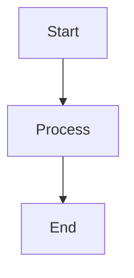

# Mermaid Export Pro - User Guide

**Version**: 1.0.3  
**Publisher**: GSejas

A professional VS Code extension for exporting Mermaid diagrams with multiple formats and cross-platform reliability.

## 📋 Table of Contents

- [Installation](#installation)
- [Quick Start](#quick-start)
- [Commands Overview](#commands-overview)
- [User Flows](#user-flows)
- [Configuration Settings](#configuration-settings)
- [Supported Formats](#supported-formats)
- [Troubleshooting](#troubleshooting)

## 🚀 Installation

1. Open VS Code
2. Go to Extensions (Ctrl+Shift+X)
3. Search for "Mermaid Export Pro"
4. Click Install
5. Run `Mermaid Export Pro: Set Up Export Tools` to configure CLI tools (optional)

## ⚡ Quick Start

1. Create or open a `.mmd` file or Markdown file with Mermaid diagrams
2. Right-click in the editor or file explorer
3. Select "Quick Export"
4. Your diagram will be exported in the configured format

## 📖 Commands Overview

### Core Export Commands

| Command | Description | Access Method |
|---------|-------------|---------------|
| **Export Current Diagram** | Export the active Mermaid file | Command Palette: `Mermaid Export Pro: Export Current Diagram` |
| **Export As...** | Choose format and location interactively | Right-click menu, Command Palette |
| **Quick Export** | Fast export with remembered preferences | Right-click menu, status bar |
| **Export Folder...** | Batch export all diagrams in a folder | Command Palette: `Mermaid Export Pro: Export Folder...` |
| **Export All Diagrams in File** | Extract and export all mermaid blocks from markdown | Command Palette: `Mermaid Export Pro: Export All Diagrams in File` |

### Utility Commands

| Command | Description | Usage |
|---------|-------------|-------|
| **Toggle Auto Export** | Enable/disable automatic export on save | Command Palette: `Mermaid Export Pro: Toggle Auto Export` |
| **Show Export Log** | View export history and debug information | Command Palette: `Mermaid Export Pro: Show Export Log` |
| **Set Up Export Tools** | Install and configure CLI dependencies | Command Palette: `Mermaid Export Pro: Set Up Export Tools` |
| **Switch Theme** | Cycle through available mermaid themes | Command Palette: `Mermaid Export Pro: Switch Theme` |
| **Show Export Options** | View current configuration | Command Palette: `Mermaid Export Pro: Show Export Options` |
| **Show Diagnostics & Health Report** | Complete system diagnostic | Command Palette: `Mermaid Export Pro: Show Diagnostics & Health Report` |
| **Debug: Export Hardcoded Diagram** | Test export functionality | Command Palette: `Mermaid Export Pro: Debug: Export Hardcoded Diagram` |

### Telemetry Commands (Optional)

| Command | Description | Usage |
|---------|-------------|-------|
| **Show Usage Statistics** | View your anonymous usage data | Command Palette: `Mermaid Export Pro: Show Usage Statistics` |
| **Export Usage Data** | Export data for bug reports/analysis | Command Palette: `Mermaid Export Pro: Export Usage Data (for bug reports)` |
| **Clear Usage Data** | Delete all collected telemetry | Command Palette: `Mermaid Export Pro: Clear Usage Data` |

> **Privacy Note**: Telemetry is opt-in and disabled by default. All data is stored locally and you have full control. Enable in settings: `mermaidExportPro.telemetry.enabled`

## 🔄 User Flows

### Flow 1: Quick Single File Export
```
1. Open .mmd file or Markdown with Mermaid diagrams
2. Right-click in editor → "Quick Export"
3. File exported to same directory with default format (PNG)
```

### Flow 2: Custom Format Export
```
1. Open Mermaid file
2. Command Palette (Ctrl+Shift+P) → "Mermaid Export Pro: Export As..."
3. Choose format (SVG, PNG, PDF, WebP, JPG, JPEG)
4. Select output location
5. File exported with chosen settings
```

### Flow 3: Mermaid Export Pro - Export Folder Workflow
```
1. Command Palette → "Mermaid Export Pro: Mermaid Export Pro - Export Folder"
2. Select folder containing Mermaid files
3. Choose export format and settings
4. All compatible files exported automatically
```

### Flow 4: Markdown Processing
```
1. Open Markdown file with embedded Mermaid diagrams
2. Command Palette → "Mermaid Export Pro: Export Markdown Diagrams"
3. Extension extracts all Mermaid code blocks
4. Each diagram exported as separate file
```

### Flow 5: Auto Export Setup
```
1. Command Palette → "Mermaid Export Pro: Toggle Auto Export"
2. Edit and save .mmd files
3. Diagrams automatically export on save
4. Toggle off when not needed
```

## ⚙️ Configuration Settings

Access settings via File → Preferences → Settings → Extensions → Mermaid Export Pro

### Core Settings

| Setting | Type | Default | Description |
|---------|------|---------|-------------|
| `defaultFormat` | string | `"png"` | Default export format (svg, png, pdf, webp, jpg, jpeg) |
| `theme` | string | `"default"` | Mermaid theme (default, dark, forest, neutral) |
| `exportStrategy` | string | `"auto"` | Export method (cli, web, auto) |
| `outputDirectory` | string | `""` | Custom output path (relative to file if not absolute) |
| `autoExport` | boolean | `false` | Automatically export on file save |

### Advanced Settings

| Setting | Type | Default | Description |
|---------|------|---------|-------------|
| `width` | number | `800` | Default export width in pixels |
| `height` | number | `600` | Default export height in pixels |
| `backgroundColor` | string | `"white"` | Background color for exports |

### Configuration Examples

```json
{
  "mermaidExportPro.defaultFormat": "svg",
  "mermaidExportPro.theme": "dark",
  "mermaidExportPro.outputDirectory": "./exports",
  "mermaidExportPro.autoExport": true,
  "mermaidExportPro.width": 1200,
  "mermaidExportPro.backgroundColor": "transparent"
}
```

## 📁 Supported Formats

### Vector Formats
- **SVG** - Scalable Vector Graphics (recommended for web)
- **PDF** - Portable Document Format (recommended for documents)

### Raster Formats
- **PNG** - Portable Network Graphics (recommended for general use)
- **WebP** - Modern web image format (smaller file sizes)
- **JPG/JPEG** - JPEG format (good for photos, not recommended for diagrams)

### Format Recommendations

| Use Case | Recommended Format | Reason |
|----------|-------------------|--------|
| Web embedding | SVG or WebP | Scalable and optimized |
| Documentation | PNG or PDF | Universal compatibility |
| High-quality prints | PDF or PNG | Crisp rendering |
| Presentations | PNG or SVG | Clear visibility |

## 🛠️ Export Strategies

### Auto Strategy (Default)
- Tries CLI export first
- Falls back to web export if CLI unavailable
- Best reliability across environments

### CLI Strategy
- Uses `@mermaid-js/mermaid-cli`
- Fastest and most accurate rendering
- Requires Puppeteer/Chromium installation

### Web Strategy
- Uses VS Code webview with mermaid.js
- No external dependencies required
- Fallback when CLI tools unavailable

## 📂 File Support

### Supported File Types
- `.mmd` - Dedicated Mermaid files
- `.md` - Markdown files with Mermaid code blocks

### Markdown Integration
The extension automatically detects Mermaid diagrams in:




## 🔧 Troubleshooting

### Common Issues

#### CLI Export Fails
**Problem**: "CLI export failed" error
**Solution**: 
1. Run "Set Up Export Tools" command
2. Check if Puppeteer/Chromium installed
3. Switch to web export strategy temporarily

#### Permission Errors
**Problem**: Cannot write to output directory
**Solution**:
1. Check folder permissions
2. Use different output directory
3. Run VS Code as administrator (Windows)

#### Large Diagram Exports
**Problem**: Export timeout or memory errors
**Solution**:
1. Increase width/height settings gradually
2. Use SVG format for large diagrams
3. Simplify complex diagrams

#### Auto Export Not Working
**Problem**: Files not exporting on save
**Solution**:
1. Verify "Toggle Auto Export" is enabled
2. Check output directory permissions
3. Review export log for errors

### Debug Tools

1. **Show Export Log** - View detailed export history
2. **Debug Export** - Test with hardcoded diagram
3. **Show Export Options** - Verify current settings

### Getting Help

1. Check the export log for detailed error messages
2. Try the debug export command to test functionality
3. Review VS Code developer console (Help → Toggle Developer Tools)
4. Report issues on the GitHub repository

## 🎯 Tips and Best Practices

### Performance Tips
- Use SVG for scalable graphics
- Set reasonable width/height limits
- Use web strategy for better compatibility

### Workflow Tips
- Set up auto-export for active development
- Use Mermaid Export Pro - Export Folder for project documentation
- Configure output directory for organized exports

### Quality Tips
- Use appropriate themes for your context
- Test exports in target applications
- Use vector formats when possible

---

*For more information, visit the [GitHub repository](https://github.com/GSejas/mermaid-export-pro).*