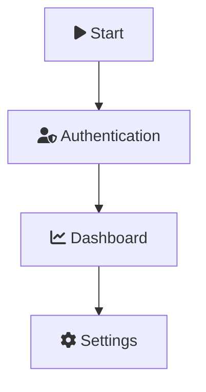

# Release Notes - v1.0.11

**Release Date**: January 2025  
**GitHub**: [v1.0.11](https://github.com/GSejas/mermaid-export-pro/releases/tag/v1.0.11)

## 🎉 What's New

### 🎨 Font Awesome 6.2.0 Icon Support (Issue #3)
Use Font Awesome icons directly in your Mermaid diagrams with `fa:fa-*` syntax!

**Example:**


**New Settings:**
- `fontAwesomeEnabled` (default: `true`) - Enables Font Awesome 6.2.0 CDN loading
- `customCss` - Array of additional CSS URLs for custom stylesheets

**How It Works:**
- **Web Export**: Injects Font Awesome CDN link into webview HTML
- **CLI Export**: Generates temporary CSS file with Font Awesome @import
- **CSP Updated**: Allows `cdnjs.cloudflare.com` for secure icon loading

**Demo**: See [demo/06-font-awesome-icons.md](https://github.com/GSejas/mermaid-export-pro/blob/master/demo/06-font-awesome-icons.md)

---

### ⚙️ Settings Consistency Improvements (Issue #2)
Fixed multiple commands to respect user JSON settings instead of always showing dialogs.

#### 1. Export Folder - New Automatic Mode
**New Setting**: `batchExportMode` (enum: `"interactive"` | `"automatic"`)

- **Interactive Mode** (default): Shows guided wizard (original behavior)
- **Automatic Mode**: Reads settings from JSON without dialogs

**Example Configuration:**
```json
{
  "mermaidExportPro.batchExportMode": "automatic",
  "mermaidExportPro.defaultFormat": "svg",
  "mermaidExportPro.defaultTheme": "dark",
  "mermaidExportPro.defaultBackgroundColor": "transparent",
  "mermaidExportPro.outputDirectory": "${workspaceFolder}/exports",
  "mermaidExportPro.organizeByFormat": true,
  "mermaidExportPro.batchExportDefaultDepth": 3
}
```

**Migration**: Existing users retain interactive mode. Set to `"automatic"` for zero-dialog workflow.

#### 2. Export All - Respects Output Directory
**Before**: Always prompted for output directory even when configured.  
**After**: Checks `outputDirectory` setting first, only prompts if empty.

**Example:**
```json
{
  "mermaidExportPro.outputDirectory": "${workspaceFolder}/exports"
}
```

#### 3. Export As - Respects Default Format
**Before**: Functionally identical to Export Current (always prompted).  
**After**: Checks `defaultFormat` setting, skips prompt if custom format configured.

**Example:**
```json
{
  "mermaidExportPro.defaultFormat": "svg"
}
```

Now "Export As" only shows format picker when using default `"png"` format. Custom formats are applied automatically.

---

## 🐛 Bug Fixes

### Export Folder Ignored User Settings (Issue #2)
- **Fixed**: Export Folder command now respects all configured settings when in automatic mode
- **Impact**: Users can configure exports entirely via JSON without dialogs
- **Affected Command**: `mermaidExportPro.batchExport`

### Export All Always Prompted for Directory
- **Fixed**: Export All now reads `outputDirectory` setting before prompting
- **Impact**: Zero-dialog workflow for users with configured output directory
- **Affected Command**: `mermaidExportPro.exportAll`

### Export As Identical to Export Current
- **Fixed**: Export As now respects `defaultFormat` setting
- **Impact**: Users with custom default formats get automatic export
- **Affected Command**: `mermaidExportPro.exportAs`

---

## 📚 Documentation Updates

### New Documentation Files
- **COMMAND-TRACKER.csv**: Comprehensive reference of all 20 commands
  - Command ID, display name, category, implementation file
  - Settings usage, dialog behavior, context menu availability
  - Status tracking and known issues
  
- **docs/FIXES-IMPLEMENTATION-SUMMARY.md**: Technical implementation details
  - Code changes for each fix
  - Settings integration patterns
  - Testing validation results

### Updated Files
- **CHANGELOG.md**: Comprehensive v1.0.11 entry with migration guide
- **README.md**: Updated configuration section with new settings
- **demo/06-font-awesome-icons.md**: Font Awesome examples and testing instructions

---

## 🔧 Technical Changes

### New Settings Added (Total: 3)

| Setting | Type | Default | Description |
|---------|------|---------|-------------|
| `batchExportMode` | `"interactive"` \| `"automatic"` | `"interactive"` | Controls Export Folder workflow |
| `fontAwesomeEnabled` | `boolean` | `true` | Enables Font Awesome 6.2.0 CDN loading |
| `customCss` | `string[]` | `[]` | Additional CSS URLs for custom stylesheets |

### ConfigManager Updates
Added 5 new getter methods:
- `getBatchExportMode()` - Returns batch export mode
- `getBatchExportDefaultDepth()` - Returns default directory depth
- `getOrganizeByFormat()` - Returns organize by format flag
- `getFontAwesomeEnabled()` - Returns Font Awesome enabled flag
- `getCustomCss()` - Returns custom CSS URLs array

### Strategy Updates
**webExportStrategy.ts**:
- Added Font Awesome CDN link injection
- Updated CSP to allow `cdnjs.cloudflare.com`
- Added custom CSS link processing

**cliExportStrategy.ts**:
- Generate temporary CSS file with Font Awesome @import
- Handle custom CSS URLs (http/https downloads, file:// inlines)
- Pass CSS file to mmdc via `--cssFile` flag

### Command Updates
**batchExportCommand.v2.ts**:
- Added automatic mode that reads settings
- Preserves interactive mode for guided workflow
- Config priority: Mode → Settings → Prompts

**exportAllCommand.ts**:
- Check `outputDirectory` setting before prompting
- Handle absolute and relative paths correctly
- Resolve relative paths against source file

**extension.ts**:
- Export As checks `defaultFormat` setting
- Skip format picker for custom defaults
- Only prompt when using default `"png"`

---

## ✅ Testing & Validation

### Test Results
- **Unit Tests**: 371/371 passing ✅
- **TypeScript Compilation**: 0 errors ✅
- **ESLint**: No warnings ✅
- **Production Build**: Successful ✅

### Manual Testing
- ✅ Font Awesome icons render in both CLI and Web exports
- ✅ Automatic mode respects all settings without dialogs
- ✅ Export All uses configured output directory
- ✅ Export As respects default format setting
- ✅ Demo file exports successfully with Font Awesome icons

---

## 🚀 Migration Guide

### For Users with Configured Settings

**Export Folder Auto Mode:**
```json
{
  "mermaidExportPro.batchExportMode": "automatic"
}
```
No dialogs shown, reads all settings from JSON.

**Export All Zero-Dialog:**
```json
{
  "mermaidExportPro.outputDirectory": "${workspaceFolder}/exports"
}
```
No directory prompt when configured.

**Export As Auto Format:**
```json
{
  "mermaidExportPro.defaultFormat": "svg"
}
```
No format picker when custom default configured.

### For New Users
Default settings provide interactive workflows with helpful wizards. Configure settings for automation when comfortable.

---

## 📦 Installation

**From VS Code Marketplace:**
1. Search for "Mermaid Export Pro"
2. Click Install
3. Reload VS Code

**From VSIX:**
```bash
code --install-extension mermaid-export-pro-1.0.11.vsix
```

**From Git:**
```bash
git clone https://github.com/GSejas/mermaid-export-pro.git
cd mermaid-export-pro
npm install
npm run compile
code .
# Press F5 to debug
```

---

## 🔗 Related Issues

- **#2**: Export Folder does not respect user JSON settings ✅ **RESOLVED**
- **#3**: Font Awesome icon support ✅ **RESOLVED**

---

## 🙏 Contributors

Thanks to all contributors and users who reported issues and provided feedback!

**Maintainer**: [@GSejas](https://github.com/GSejas)

---

## 📄 License

MIT License - See [LICENSE](LICENSE) file for details.

---

## 🔮 What's Next (v1.0.12)

Looking for feedback on:
- Additional icon libraries support
- More export format options
- Custom theme configurations
- Enhanced batch export options

Open an issue or discussion to share your ideas!

---

**Full Changelog**: [v1.0.10...v1.0.11](https://github.com/GSejas/mermaid-export-pro/compare/v1.0.10...v1.0.11)
